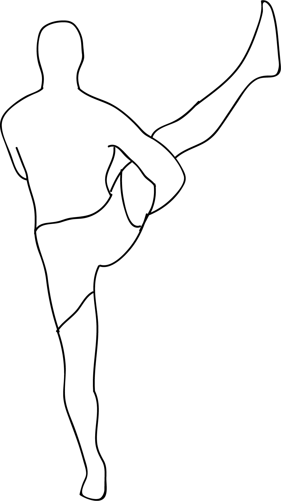

# Parivrtta Svarga Dvijasana

[TOC]

**Parivrtta Svarga Dvijasana**  is an Asana. It is translated as ***Revolved Bird of Paradise Pose*** from **Sanskrit**.

This pose is a variation of Svarga Dvijasana.

## Benefits
1. It stretches the outside of the thigh.
1. The rotator cuff and front shoulders.
1. Promotes spinal flexibility and balance.

## Cautions
* Be careful while doing this pose if you have any spinal, shoulder, knee or hip injuries.

## References

## References

1. ["wikipedia"](https://en.wikipedia.org/wiki/Parivrtta_Svarga_Dvijasana)
