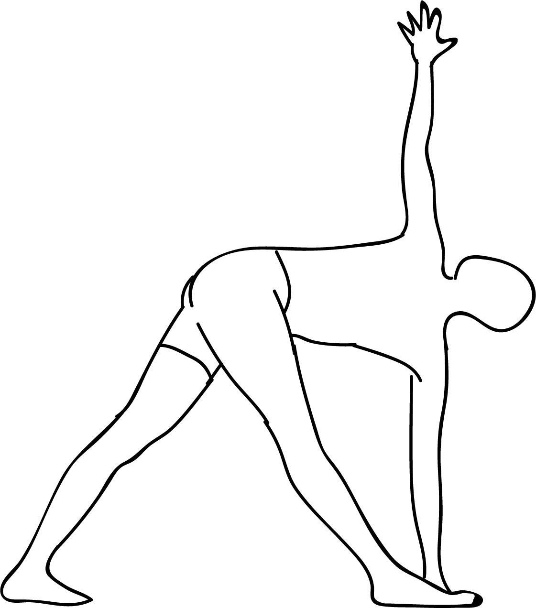

# Parivrtta Trikonasana

[TOC]

**Parivrtta Trikonasana** is an Asana Yoga pose. It is translated as **Revolved Triangle Pose** from **Sanskrit**, the name of this pose comes from **parivrtta** meaning **revolved**, **tri** meaning **three**, **kona** meaning **angle** and **asana** meaning **posture** or **seat**. This pose is a variation of Trikonasana or Triangle Pose.

## Technique
1. To begin the Parivrtta Trikonasana asana, stand in Tadasana (or mountain pose), i.e. feet together, toes touching and hands by your side. Exhale and jump with your feet, 3-4 feet apart.
1. Raise your arms parallel to the mat. They should be in the line with your shoulder and be facing down.
1. Turn your right foot 90 degrees to the right & left foot 45 degrees to your right. Make sure your left and right heels are aligned and turn your right thigh outward.
1. Slowly turn to your right, exhale and bend down in front of your right leg and touch the floor with your left hand. Inhale and raise your right arm up towards the ceiling.  You can even use the “yoga -block” for the support, if you are unable to touch the floor. Turn your head up and look at the thumb of the raised hand.
1. Make sure your neck is in a comfortable position.

## Effects
* Tones stretches and strengthens the muscles of hamstring, thigh and
* Massages reproductive organs and pelvic region of the body.
* Gives an intense stretch to the spine and enhances its flexibility. Strengthens spinal nerves.
* Removes the stiffness of neck and Beneficial in correcting the misalignment of the shoulders.
* Directs the blood flow in the lower region of the spine improving its functioning.
* Revitalize abdominal organs hence helpful in getting rid of digestive problems and constipation.
* Helpful in getting rid of anxiety as it stimulates the whole functioning of the nervous system.

## Related Asanas
* [Baddha Konasana
* [[Prasarita Padottanasana](Baddha_Konasana
*_[[Prasarita_Padottanasana.md)
* [Siddhasana or Sukhasana](Siddhasana_or_Sukhasana.md)
* [Supta Virasana](../yoga/Supta_Virasana.md)

## Special requisites
Avoid this asana if you have the following conditions:

* Low blood pressure
* Migraine
* Diarrhea
* Headache
* Insomnia

## Initial practice notes
If you assume a narrow stance, this asana becomes easier. Therefore, as a beginner, make it a practice to bring the hand closer to the inner foot.

## References

## External Links
* [Parivrtta Trikonasana on yogajournal.com](https://www.yogajournal.com/poses/revolved-triangle-pose)
* [Parivrtta Trikonasana on yogicwayoflife.com](http://www.yogicwayoflife.com/parivrtta-trikonasana-revolved-triangle-pose/)
* [Parivrtta Trikonasana on augustyoga.com](http://www.augustyoga.com/Asanas/Parivrtta-Trikonasana-Revolved-Triangle-Pose/35)

## References

1. [Methodology](https://www.sepalika.com/type-2-diabetes/parivrtta-trikonasana/)
2. [tips](Beginers)(https://www.stylecraze.com/articles/parivrtta-trikonasana-revolved-triangle-pose/#Beginner’sTip)
3. [benefits](Health)(http://www.finessyoga.com/yoga-asanas/parivrtta-trikonasana-steps-benefits)
