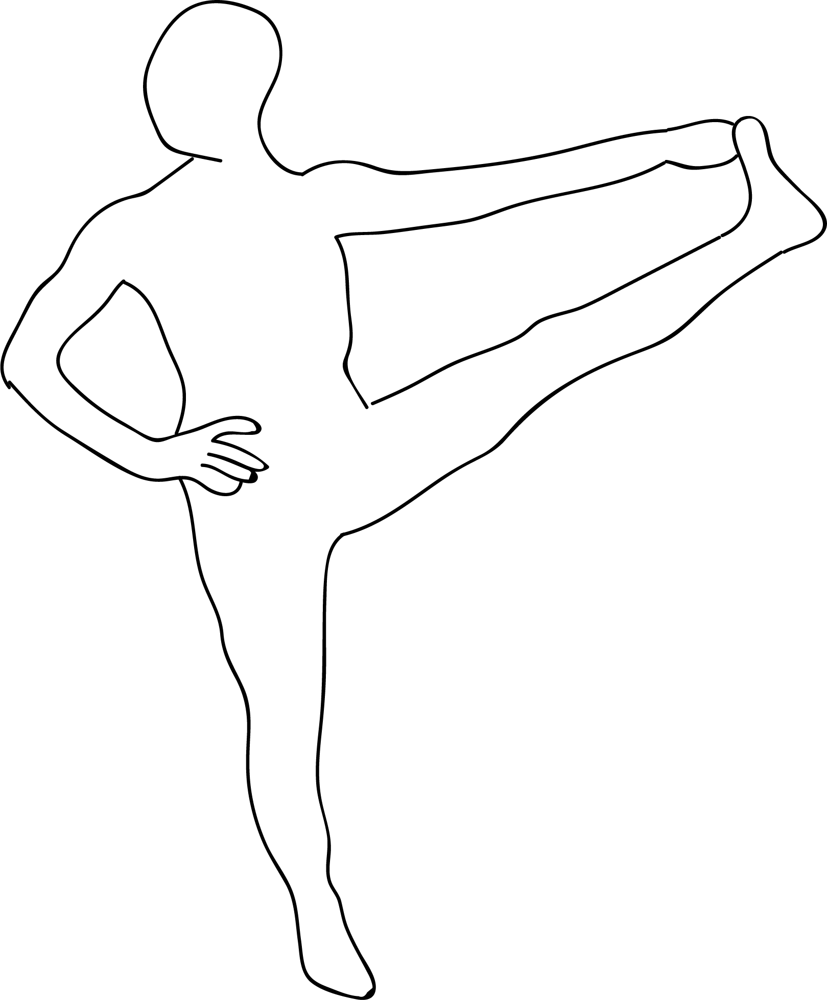

# Parivrtta Utthita Pada Hastasana

[TOC]

**Parivrtta Utthita Pada Hastasana**  is an Asana. It is translated as ***Revolved Extended Hand to Foot Pose*** from **Sanskrit**.

The name of this pose comes from "parivrtta" meaning "revolved", "utthita" meaning "extended", "pada" meaning "leg", "hasta" meaning "hand", and "asana" meaning "posture" or "seat".

## Benefits
1. It stretches the outside of the thigh.
1. Promotes spinal flexibility and balance.

## Cautions
* Be careful while doing this pose if you have any spinal, knee or hip injuries.

## References

## References

1. ["wikipedia"](https://en.wikipedia.org/wiki/Parivrtta_Utthita_Pada_Hastasana)
