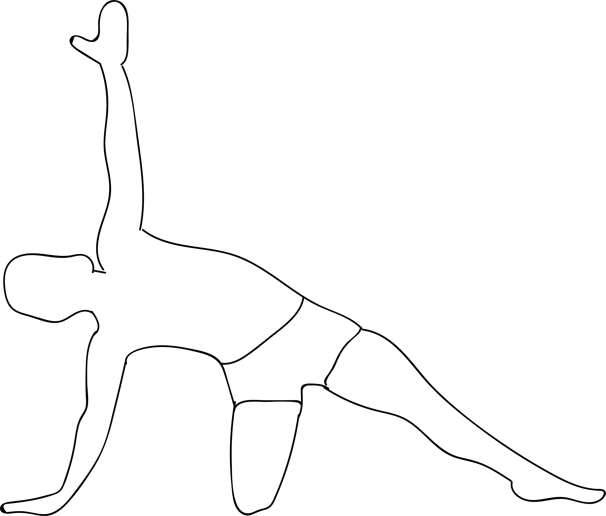

# Parsva Dandasana

[TOC]

**Parsva Dandasana** is an Asana. It is translated as Sideways Staff Pose from Sanskrit. The name of this pose comes from **parsva** meaning **to the side**, **danda** meaning **staff**, and **asana** meaning **posture** or **seat**.

## Technique
1. Stand in Tadasana (Mountain pose). Cross your right ankle just above your left knee and flex your foot.
1. Lower into a squat, balancing on your left toes. Bring your fingertips to the floor.
1. Twist your upper body to the left. Position the arch of your right foot against the back of your right arm. Place your palms on the floor to your left, shoulder-width apart.
1. Bend your elbows and shift your bodyweight into your hands. Extend your left leg to the right and draw your elbows together.
1. Balance in the pose for several breaths. Exhale and bend your left leg, then slowly release the pose. Change sides.

## Technique in pictures/animation
## Effects
* Helps improve posture
* Strengthens back muscles
* Lengthens and stretches the spine
* May help to relieve complications related to the reproductive organs
* Stretches shoulders and chest
* Nourishes your body’s resistance to back and hip injuries
* Helps to calm brain cells
* May improve functionality of the digestive organs
* Creates body awareness
* Helps improve alignment of body
* Provides a mild stretch for hamstrings

## Related Asanas
* [Dandasana](../yoga/Dandasana.md)

## Special requisites
Dont do this pose if you have following conditions:

* Pregnancy
* Wrist, shoulder, or low back injuries

## Initial practice notes
Placing the foot on the mat is essential in this pose. Quite often it is done with the feet together like in Tadasana (shown in the pictures

## References

## External Links
* [Parsva Dandasana on ihanuman.com](https://www.ihanuman.com/asana/parsva-dandasana)
* [Parsva Dandasana on ipfs.io](https://ipfs.io/ipfs/QmXoypizjW3WknFiJnKLwHCnL72vedxjQkDDP1mXWo6uco/wiki/Parsva_Dandasana.html)
* [Parsva Dandasana on yogapedia.com](https://www.yogapedia.com/definition/7731/parsva-bhuja-dandasana)

## References

1. ["Methodology"](https://beyogi.com/learn-yoga/poses/dragonfly-pose/)
2. [tips"]("Beginers)(http://www.yogacards.com/yoga-postures-2/staff-side.html)
3. [benefits"]("Health)(http://www.cnyhealingarts.com/2010/11/29/the-health-benefits-of-dandasana-staff-pose-or-stick-pose/)
