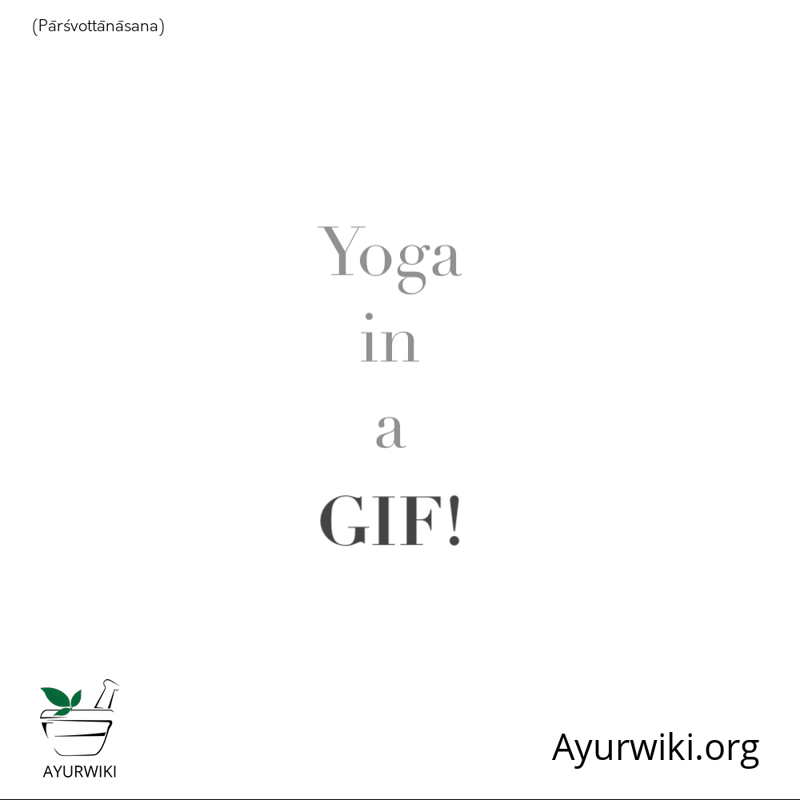
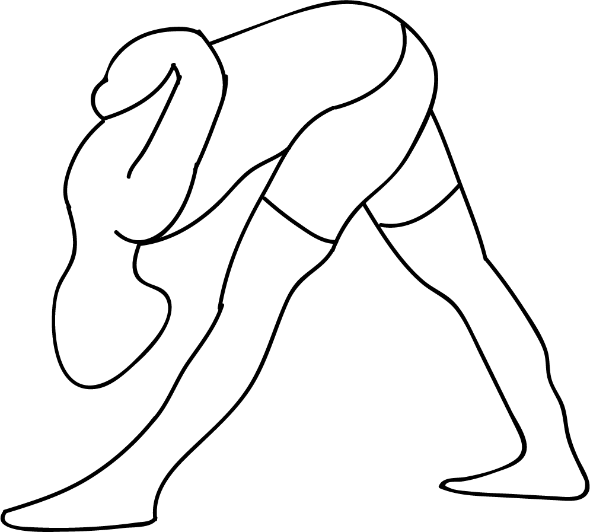

# Parsvottanasana

[TOC]

**Parsvottanasana** is an Asana. It is translated as **Intense Side Stretch** from Sanskrit. It is also referred to as "Pyramid" Pose. The name of this pose comes from **parsva** meaning **side**, **ut** meaning **intense** , and **tan** meaning **to stretch**, and **asana** meaning **posture** or **seat**.

## Technique
* Stand erect. Let the feet be close to each other.
* Bring your arms behind your back and bend them to keep your palms together. This would resemble salutation pose.
* Shift the right leg to place it 4 feet away from the left leg.
* Exhale and bend your body towards your right and place your forehead on your knee. You may stretch beyond if possible. Keep your knees straight.
* Raise and repeat the procedure in the left side.

## Technique in pictures/animation
## Effects
* Calms the brain
* Stretches the spine, shoulders and wrists (in the full pose), hips, and hamstrings
* Strengthens the legs
* Stimulates the abdominal organs
* Improves posture and sense of balance
* Improves digestion

## Related Asanas
* [Adho Mukha Svanasana](../yoga/Adho_Mukha_Svanasana.md)
* [Anjali Mudra](Anjali_Mudra.md)
* [Baddha Konasana](Baddha_Konasana.md)
* [Gomukhasana](../yoga/Gomukhasana.md)
* [Prasarita Padottanasana](../yoga/Prasarita_Padottanasana.md)

## Special requisites
Dont do this pose if you have following conditions:

* If you have high blood pressure or a back injury, you must do the Ardha Parsvottanasana.
* Avoid doing this asana if you are pregnant, or if you have an injury in your hamstring.

## Initial practice notes
As beginners, you might not be flexible enough to take your hands to the ground; you might not be able to press them behind your back as well. To solve this problem, you can cross your arms behind your back, ensuring they are placed parallel to your waist. You can then hold each elbow with the opposite hand. Just remember that when the right foot is in front, your right arm is placed around the back, and when the left foot is in front, the left arm is placed around the back first.

## References

## External Links
* [Parsvottanasana on siddhiyoga.com](https://www.siddhiyoga.com/parsvottanasana-intense-side-stretch-pose)
* [Parsvottanasana on dolittleyoga.com](http://www.dolittleyoga.com/tag/benefits-of-parsvottanasana/)
* [Parsvottanasana on feelgoodyogavictoria.com](http://www.feelgoodyogavictoria.com/learning-centre/yoga/pyramid-parsvottanasana-pose/)

## References

1. ["Methodology"](http://doctorinyourbody.blogspot.com/2013/01/benefits-of-parsvottanasana-intense.html)
2. [tips"]("Beginers)(http://www.stylecraze.com/articles/parsvottanasana-pyramid-pose/#Beginner’sTip)
3. [benefits"]("Health)(http://www.cnyhealingarts.com/2011/01/07/the-health-benefits-of-ananda-balasana-happy-baby-pose/)
