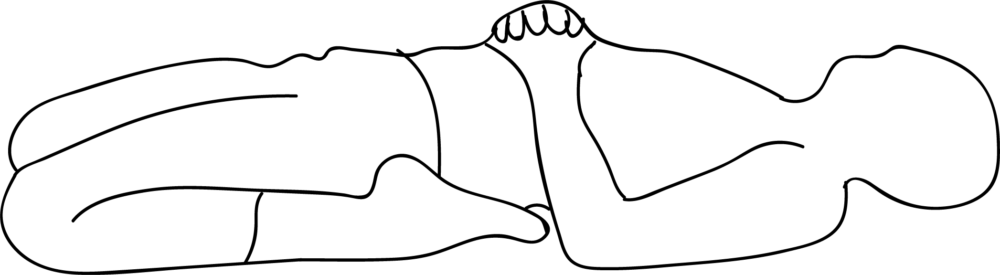

# Paryankasana

[TOC]

**Paryankasana** is an Asana. It is translated as ***Bed or Couch Pose*** from **Sanskrit**. The name of this pose comes from **paryanka** meaning **bed** or **couch**, and **asana** meaning **posture** or **seat**.

## Technique
1. Sit in virasana with your pelvis on the floor. Place a bolster horizontal to your spine. The bolster or blanket platform should be 6-10″ tall, or enough to elevate your thoracic spine in such a way that you achieve a dome shape in your upper trunk.
1. As you recline, be sure that the prop is under your shoulder blades, not the middle of your back. The arch should resemble the fish pose (matsyasana).
1. As you recline pin your shoulder blades away from your ears, trapping them on the bolster so that your entire upper body is wedged upward. Be sure that your head stays in contact with the floor. Should your head float, then support it with a blanket.
1. With your hands clasped into your elbows, extend your elbows toward the wall behind you and down toward the floor. However the elbows need not be on the floor.
1. Stay for 2-3 minutes.
1. The pose can be done without the prop support. in the unsupported version, be sure that you weight bear on the mid line of the skull. In both versions the pelvis does not leave the floor.

## Technique in pictures/animation
## Effects
* Upward Couch Pose strengthens and stretches your quads, lower back, neck, and shoulders.
* Gives relieve to your tired legs and improves your digestion also.
* Urdhva Paryankasana Clams your mind, relax your body.
* It gives relieve in the menstrual pain.

## Related Asanas
* [Adho Mukha Svanasana](../yoga/Adho_Mukha_Svanasana.md)

## Special requisites
* Avoid this movement if you have a back injury, a knee injury, if you are suffering from a headache, a migraine or if you are pregnant of menstruating.

## Initial practice notes
## References

## External Links
* [Paryankasana on ](https://www.tummee.com/yoga-poses/paryankasana)
* [Paryankasana on stylesatlife.com](http://stylesatlife.com/articles/paryankasana/)
* [Paryankasana on yoga.org.nz](http://yoga.org.nz/yoga_postures_main_page/image-quick-find-yoga-positions/couch-pose-paryankasana/)

## References

1. ["Methodology"](https://www.prajnayoga.net/asana-anatomy-focus/the-couch-pose-paryankasana/)
2. [benefits"]("Health)(https://www.sarvyoga.com/urdhva-paryankasana-upward-couch-pose/)
