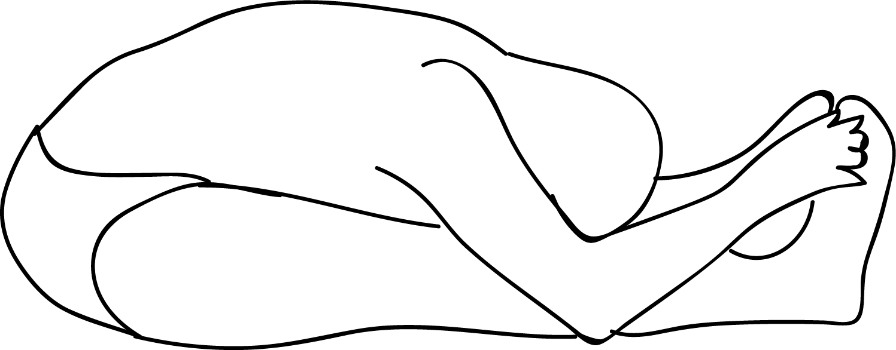

# Paschimottanasana

[TOC]

Pashimottanasana or Intense Dorsal Stretch is an asana. Together with Padmasana (lotus), Siddhasana (half-lotus) and Vajrasana (lightning-bolt pose), this asana is an accomplished asana according to the Shiva Samhita. It was advocated by 11th century yogi Gorakshanath .

## Technique
1. Sit in an upright position with your legs stretched out straight in front of you. Keep the soles of your feet straight with your toes pointed towards the ceiling.
1. Inhale and slowly raise your arms over your head with your palms facing forward. Keep your back straight as you stretch and take a deep breath.
1. Exhale and slowly bend forward keeping your spine straight. Your spine, neck, and your arms should be aligned.
1. Stretch out your arms and let them reach the furthest they can along your legs. Depending on how flexible you are, you can either wrap your palms around the soles of your feet or hold your big toes gently. Your elbows should touch the floor.
1. Complete your forward fold until your forehead is nestled against your shins.
1. Stay in this position for 5-10 seconds or longer if possible.

## Technique in pictures/animation
## Effects
* Calms the brain and helps relieve stress and mild depression
* Stretches the spine, shoulders, hamstrings
* Stimulates the liver, kidneys, ovaries, and uterus
* Improves digestion
* Helps relieve the symptoms of menopause and menstrual discomfort
* Soothes headache and anxiety and reduces fatigue
* Therapeutic for high blood pressure, infertility, insomnia, and sinusitis
* Traditional texts say that Paschimottanasana increases appetite, reduces obesity, and cures diseases.

## Related Asanas
* [Uttanasana](../yoga/Uttanasana.md)
* [Janu Sirsasana](../yoga/Janu_Sirsasana.md)
* [Bālāsana](Bālāsana.md)

## Special requisites
It is essential to practice this pose correctly to avoid injury.

* Avoid this asana if you have asthma or diarrhea.
* In case you have a back injury, you must make sure to practice this asana only under the guidance of a certified yoga instructor.
* Pregnant women must avoid practicing this asana.

## Initial practice notes
As a beginner, you must remember never to push yourself if you are not comfortable in a forward bend. This is more important if the asana entails sitting on the floor

This is one of the Asanas prescribed in [Hatha Yoga Pradipika](Hatha_Yoga_Pradipika_(book).md).

## References

## External Links
* [Paschimottanasana on arogyayogaschool.com](https://arogyayogaschool.com/blog/health-benefits-of-seated-forward-bend-yoga-pose/)
* [Paschimottanasana on eyogaguru.com](https://eyogaguru.com/paschimottanasana-seated-forward-bend-pose/)
* [Paschimottanasana on naturehomeopathy.com](https://www.naturehomeopathy.com/steps-to-perform-paschimottanasana-and-its-benefits.html)

## References

1. ["Methodology"](https://thehealthorange.com/stay-fit/yoga/paschimottanasanaseated-forward-bend-pose-6-steps-benefits/)
2. [tips"]("Beginers)(http://www.stylecraze.com/articles/paschimotthanasana-seated-forward-bend-pose/#Beginner’sTip)
3. [benefits"]("Health)(https://www.yogajournal.com/poses/seated-forward-bend)
