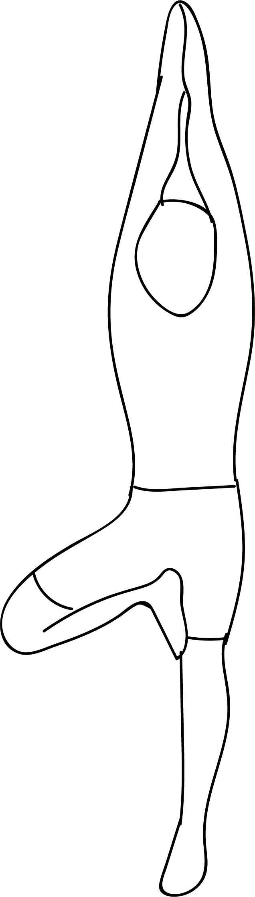

# Patan Vrikshasana 2

[TOC]

**Patan Vrikshasana 2**  is an Asana. It is translated as ***Toppling Tree Pose 2*** from **Sanskrit**.

The name of this pose comes from "patan" meaning "toppled", "vriksha" meaning "tree", and "asana" meaning "posture" or "seat". This pose is a variation of Vriksasana.

## Benefits
1. It opens the chest and front shoulders.
1. Stretches the hamstrings.
1. Sromotes a sense of balance.

## Cautions
* Be careful while doing this pose if you have any ankle, knee, hip, lower back or shoulder injuries or if you suffer from high blood pressure.

## References

## References

1. ["wikipedia"](https://en.wikipedia.org/wiki/Patan_Vrikshasana_2)
