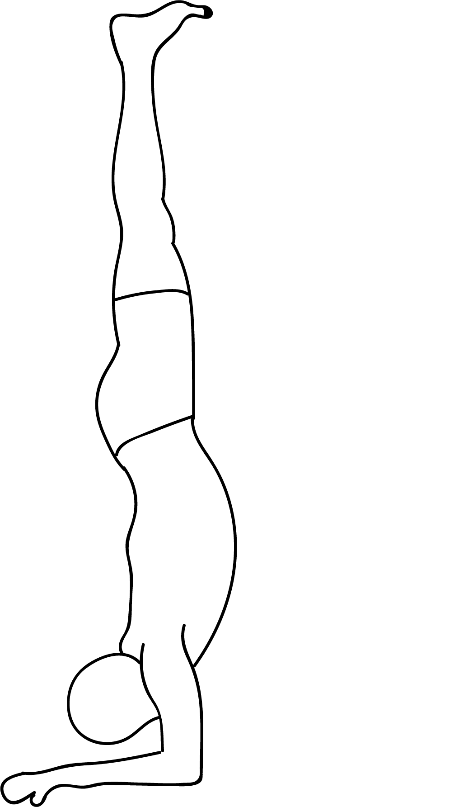

# Pincha Mayurasana

[TOC]

**Pincha Mayurasana** is an Asana. It is translated as **Peacock Feather Pose** from **Sanskrit**, the name of this pose comes from **pincha** meaning **feather**, **mayura** meaning **peacock** and **asana** meaning **posture** or **seat**.

## Technique
1. Go down and rest on your belly.
1. Slowly bend your elbows and keep them directly under your shoulders. Make Anjali Mudra (Namaskar Pose) by joining your palms together.
1. Pincha-Mayurasana-Feathered-Peacock-Pose-step-2Raise your hips up. Now slowly try to step up (walk) towards your arms, as much as you can.
1. Lift up your right leg, and kick up the left leg off the floor.
1. Remain in this position for few seconds.
1. Keep your head remain on the floor. Ensure that your shoulders are far from your ears.
1. Pincha-Mayurasana-Feathered-Peacock-Pose-step-3Keep your feet perpendicular to the floor. Stay in the position as much as you can and breathe slowly. # Now put down your legs slowly one by one on the floor and release the pose.

## Technique in pictures/animation
## Effects
* Pincha Mayurasana Stretches shoulders, Neck, Navel, belly and Thorax; strengthens your shoulders, back and arms.
* Improves concentration level and gives calmness to your mind.
* Kick out the stress and mild depression.
* Feathered Peacock Pose Improves your body posture.
* Makes your wrists and elbows stronger.

## Related Asanas
* [Adho Mukha Vrikshasana](../yoga/Adho_Mukha_Vrikshasana.md)
* [Adho Mukha Svanasana](../yoga/Adho_Mukha_Svanasana.md)
* [Gomukhasana](../yoga/Gomukhasana.md)

## Special requisites
* It is best to avoid this asana if you have a heart condition or suffer from high blood pressure.
* Avoid practicing this asana if you have a headache, or a shoulder, neck, or back injury.
* Menstruating and pregnant women must steer clear of this asana.

## Initial practice notes
As beginners, it might be difficult to stop your elbows from sliding away from each other when you assume this pose.

## References

## External Links
* [Pincha Mayurasana on yogajournal.com](https://www.yogajournal.com/practice/3-prep-poses-forearm-balance-pincha-mayurasana)
* [Pincha Mayurasana on thejourneyjunkie.com](http://www.thejourneyjunkie.com/yoga-3/11-poses-prep-pincha-mayurasana/)
* [Pincha Mayurasana on eat-sleep-yoga-repeat.com](https://www.eat-sleep-yoga-repeat.com/2017/11/22/pincha-mayurasana-forearm-balance/)

## References

1. ["Methodology"](https://www.sarvyoga.com/pincha-mayurasana-feathered-peacock-pose-steps-and-benefits/)
2. [tips"]("Beginers)(https://www.stylecraze.com/articles/pincha-mayurasana-feathered-peacock-pose/#Beginner’sTip)
3. [benefits"]("Health)(https://www.sarvyoga.com/pincha-mayurasana-feathered-peacock-pose-steps-and-benefits/)
