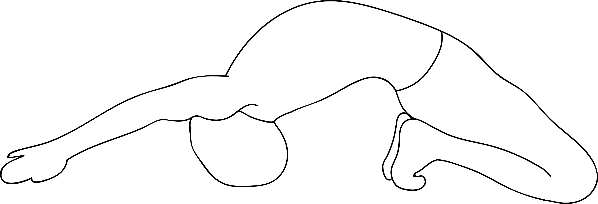

# Prapada Kapotasana

[TOC]

**Prapada Kapotasana** is an Asana. It is translated as Tiptoe Pigeon Pose from Sanskrit. the name of this pose comes from **prapada** meaning **'tips of the toes**, **kapota** meaning **pigeon**, and **asana** meaning **posture** or **seat**.

## Technique
1. Start the practice by assuming the Ustrasana.
1. Inhale and lift the lower part of your belly up. But ensure you pull it in before you raise it. While you do this, move your tailbone downwards to stabilize the lower back. Gently exhale.
1. Inhale, and pull up both your arms, such that they are along your ears. You could bring your palms together if possible. Exhale and then move backward, making sure your lower back is long but stable. Make sure there is no pain or strain. Inhale and then go further, sternum first.
1. Gently lift your shoulders and squeeze your elbows towards each other. Move your head back, and hold the pose for at least five breaths.
1. Inhale again, and let your arms reach the floor. Press your feet into the floor, and then bend the knees only as much as it is necessary to reach the palms of the hands, reaching outside each foot. Keep moving backward as you check with your lower back from time to time.
1. Walk your hands backward towards your knees so that the fingers meet the heels. Once they do, clutch them tightly.
1. Now as you hold both your feet, squeeze the elbows towards each other, and push the hip forward while keeping the space and length of your lower back intact.
1. As you exhale, bend your elbows and fix them on the floor. Hold the position for about 30 seconds to one minute, or as long as you are comfortable.
1. Gently come out from the posture while keeping your breath normal. Roll on your spine and assume the Balasana or the child’s pose before you come back to normal.

## Technique in pictures/animation
## Effects
This challenging backbend has many benefits: it stimulates the internal organs, promotes balance, increases spinal flexibility, stretches abdominals and the front of the thighs.

## Related Asanas
* [Supta Virasana](../yoga/Supta_Virasana.md)
* [Dhanurasana](../yoga/Dhanurasana.md)
* [Eka Pada Rajakapotasana](../yoga/Eka_Pada_Rajakapotasana.md)

## Special requisites
It is important that you listen to your body. If you feel any pain in your shoulders or lumbar spine, make sure you back off immediately. Only if you feel the pain while feeling stable, almost like you are moving deeper in the pose, should you continue with the exercise.

## Initial practice notes
If you are a beginner, you could use the support of a wall to get this pose right. Press your soles to the wall, and using your head to grip your hands, gently lean backward.

## References

## External Links
* [Prapada Kapotasana on ipfs.io](https://ipfs.io/ipfs/QmXoypizjW3WknFiJnKLwHCnL72vedxjQkDDP1mXWo6uco/wiki/Prapada_Kapotasana.html)
* [Prapada Kapotasana on stylecraze.com](https://www.stylecraze.com/articles/hair/?ref=menu)
* [Prapada Kapotasana on mryoga.com](http://mryoga.com/backbend-yoga-poses/yoga-pose-tip-toe-pigeon-pose-prapada-kapotasana/)

## References

1. ["Methodology"](https://www.stylecraze.com/articles/kapotasana-pigeon-pose/#Kapotasana)
2. [tips"]("Beginers)(https://www.stylecraze.com/articles/kapotasana-pigeon-pose/#BeginnersTips)
