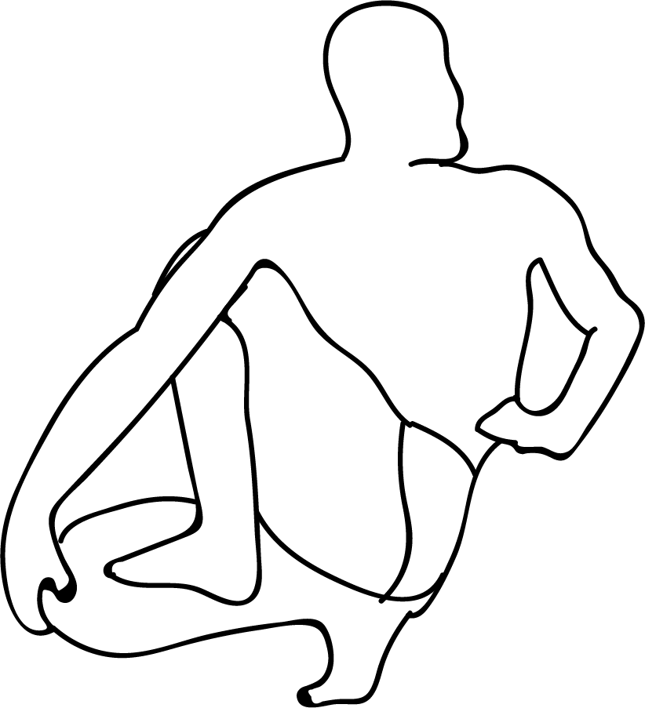

# Prapada Matsyendrasana

[TOC]

**Prapada Matsyendrasana** is an Asana. It is translated as **Tip Toe Lord of the Fishes Pose** from **Sanskrit**. the name of this pose comes from **prapada** meaning **tip toe**, **Matsyendra** in referense to a legendary Hindu Sage, and **asana** meaning **posture** or **seat**.

## Technique
1. Sit in Vajrasana position or sit straight with stretching your legs in front of you.
1. Bend your left leg and try to touch your feet to your right buttock as shown in the above image.
1. Bring your right leg outside of the left knee. Touch your feet to the ground. Keep your spine erect.
1. Exhale and turn your upper body to the right. Hold your right feet with a left hand and place your right hand behind you are on the ground as shown in the above image.
1. Breathe normally and hold this posture for 20 to 30 seconds. After practice, you can hold this posture for 3 to 5 minutes.
1. Now release this posture and repeat this cycle with bending the right leg and bringing left leg outside of the right knee. (i.e. Twisting the opposite direction).

## Technique in pictures/animation
## Effects
* Releases lower back and sacrum
* Opens hips, inner thighs, and groin
* Stretches the hamstrings
* Relieves lower back pain
* Stretches and soothes the spine
* Calms the brain
* Helps relieve stress and fatigue.

## Related Asanas
* [Baddha Koṇāsana](Baddha_Koṇāsana.md)
* [Janusirsasana](Janusirsasana.md)
* [Virasana](../yoga/Virasana.md)

## Special requisites
* This asana must be avoided during pregnancy and menstruation as it entails a strong twist at the abdomen.
* People who have recently undergone abdominal, heart or brain surgeries, should not practice this asana.

## Initial practice notes
The many hand variations in this pose can make it quite hard for beginners to adapt. First of all, make sure you sit on a blanket and practice this pose.

## References

## External Links
* [Prapada Matsyendrasana on stylecraze.com](https://www.stylecraze.com/articles/ardha-matsyendrasana-fish-pose/#gref)
* [Matsyendrasana on eyogaguru.com](https://eyogaguru.com/ardha-matsyendrasana-half-twist-yoga-pose-benefits-steps/Prapada)

## References

1. ["Methodology"](https://eyogaguru.com/ardha-matsyendrasana-half-twist-yoga-pose-benefits-steps/)
2. [tips"]("Beginers)(https://www.stylecraze.com/articles/ardha-matsyendrasana-fish-pose/#gref)
3. [benefits"]("Health)(https://www.sarvyoga.com/ardha-matsyendrasana-half-spinal-twist-pose-steps-benefits/)
