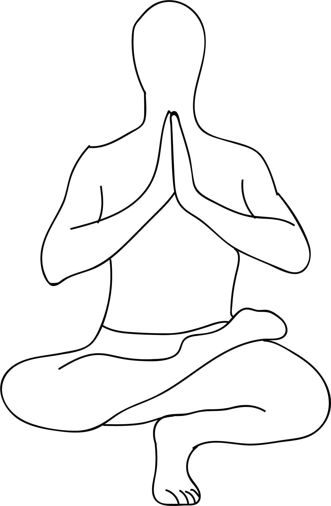

# Prapadasana

[TOC]

**Prapadasana** is an Asana. It is translated as **Tip Toe Pose** from **Sanskrit**. The name of this pose comes from **prapada** meaning **tips of the feet**, and **asana** meaning **posture** or **seat**.

## Technique
1. From Mountain pose with feet together, bend the knees and allow the heels to lift off the floor as you lower the hips to the heels and bring the fingertips to the floor.
1. Draw the knees down and in towards each other. Stare at a point on the floor in front of you.
1. Keeping your gaze fixed, slowly inhale the arms together in prayer position in front of your heart. Keep the shoulders down and back and the sternum pressing forward.
1. Stay here or you can slowly inhale the arms up over your head with the palms together.
1. Breathe and hold for 2-5 breaths.

## Technique in pictures/animation
## Effects
* Improves concentration and sense of balance.
* Strengthens the feet, ankles, calves, knees and thighs.
* Stretches the hip flexors, hamstrings and groins.
* Stimulates the Muladhara / Root Chakra

## Related Asanas
* [Adho Mukha Svanasana](../yoga/Adho_Mukha_Svanasana.md)

## Special requisites
* Anyone suffering from severe leg or hip injuries.

## Initial practice notes
* If you find it difficult to hold your feet, use a yoga strap by looping it around the middle arch.

## References

## External Links
* [Prapadasana on tummee.com](https://www.tummee.com/yoga-poses/prapadasana)
* [Prapadasana on 365dayspact.wordpress.com](https://365dayspact.wordpress.com/2017/04/25/ardha-padma-prapadasana-half-lotus-tip-toe-pose-balance-is-the-key-to-everything/)

## References

1. ["Methodology"](http://yogamission.org/index.php?option=com_content&view=article&id=92)
2. [benefits"]("Health)(https://365dayspact.wordpress.com/2017/09/13/prapadasana-tip-toe-pose-balance-is-the-key-to-everything/)
