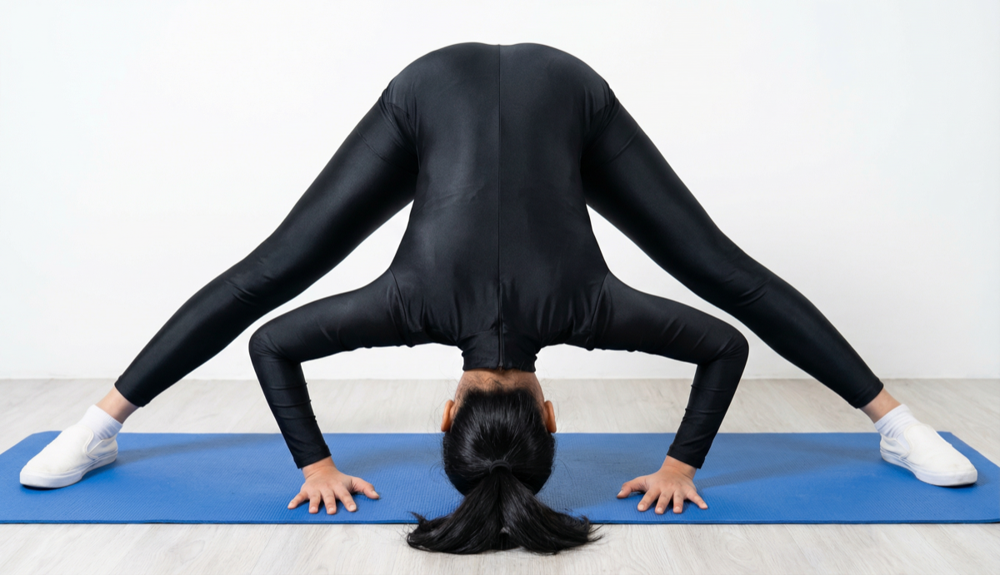

# Prasarita Padottanasana

[TOC]

**Prasaritapadottanasana** is an Asana. It is translated as **Legs Spread Intense Stretch Pose** or **Wide Legged Forward Bend** from **Sanskrit**. the name of this pose comes from **prasarita** meaning **spread apart**, **pada** meaning **foot**, **uttana** meaning **intense stretch** and **asana** meaning **posture** or **seat**.

## Technique
1. Now lift your inner curves, by drawing internal lower legs up, firm external edge of feet and big toes of feet into floor. Connect with your thighs by drawing them up.
1. After that you can join your palms together towards to your back and interlock your fingers. If this is too hard, simply seize an inverse elbows with your hands.
1. Breathe in stretch the front of the body, breathe out overlap forward from the hips, holding the back straight and the mid-section open, and keeping the hips over the heels.
1. Now bring your head towards the ground, and if your hands are caught, take your arms the distance towards the floor, while you keep up the vibe of the shoulder blades on the back.Take a couple of breaths here.
1. At the full forward curve you discharge the head down, you can put your head on the floor.
1. Remain in this position about 6 to 12 breathes.
1. Make sure that your back should be straight as much as you can, and not to overstretch your hamstrings.
1. To release this stance, breathe in and lift move down as you press into your feet.
1. Returned into Mountain Pose.

## Technique in pictures/animation
## Effects
* Prasarita Padottanasana stretches your back and legs.
* Wide-Legged Forward Bend Pose is best exercise for opening the hips.
* Stretches your shoulders, chest and spine.
* Prasarita Padottanasana relaxes your body and calms your mind.
* Beneficial in mild backache problems.

## Related Asanas
* [Adho Mukha Svanasana](../yoga/Adho_Mukha_Svanasana.md)
* [Uttanasana](../yoga/Uttanasana.md)
* [Supta Baddha Konasana](../yoga/Supta_Baddha_Konasana.md)

## Special requisites
* Avoid this asana at all costs if you have pain or an injury in the lower back.
* Also, avoid this asana if you have sinus congestion.

## Initial practice notes
As beginners, it might be hard for you to touch your crown to the floor. Push yourself only as much as you can. Use a blanket, bolster, or a padded block to support your head in this asana.

## References

## External Links
* [Prasaritapadottanasana on yogajournal.com](https://www.yogajournal.com/poses/wide-legged-forward-bend)
* [Prasaritapadottanasana on yogawiz.com](http://www.yogawiz.com/yoga-poses/standing-poses/wide-legged-forward-bend-prasarita-padottanasana.html)
* [Prasaritapadottanasana on astrolika.com](http://www.astrolika.com/yoga/prasarita-padottanasana.html)

## References

1. ["Methodology"](https://www.sarvyoga.com/prasarita-padottanasana-wide-leg-forward-fold-yoga-steps-and-benefits/)
2. [tips"]("Beginers)(https://www.stylecraze.com/articles/prasarita-padottanasana-wide-legged-forward-bend-pose-its-benefits/#Beginner’sTip)
3. [benefits"]("Health)(http://www.astrolika.com/yoga/prasarita-padottanasana.html)
