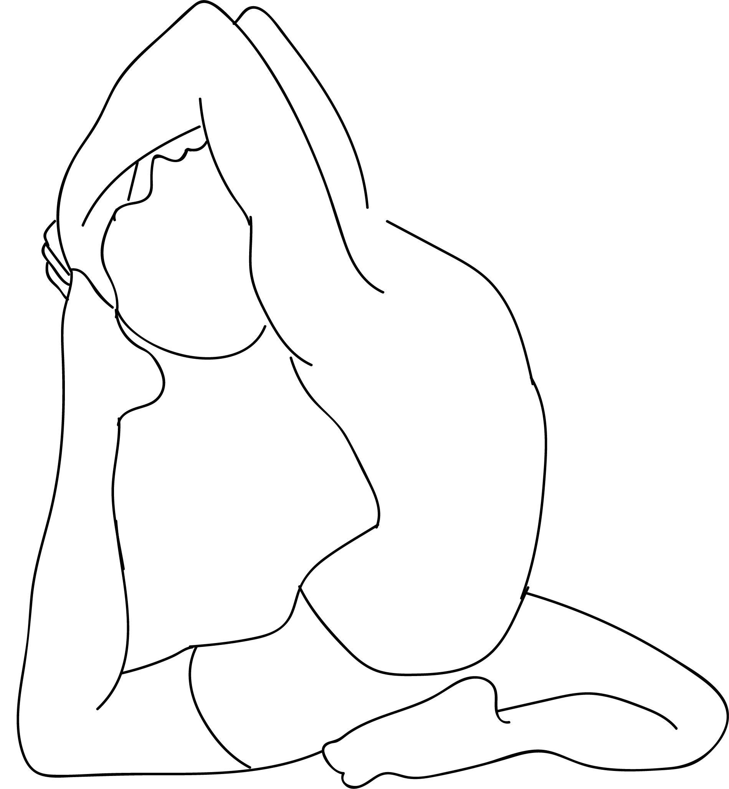

# Rajakapotasana

[TOC]

Raja Kapotasana is an asana. The name comes from the Sanskrit words **raja** meaning **king**, kapota meaning **pigeon** and asana meaning **posture** or **seat**.

## Technique
1. Begin off on your fours, ensuring your knees are set directly under your hips and your hands somewhat in front of your shoulders.
1. After that tenderly slide your right knee forward, with the end goal that it is simply behind your right wrist. During this, keep your right shin under your torso, and acquire your right foot front of your left knee. The exterior of your right shin must lie on the floor.rajakapotasana-king-pigeon-pose-steps
1. Gradually, slide your left leg to the back. Rectify your knee, and drop the front of your thighs to the floor. Bring down the exterior of your right backside on the floor. Place your right heels before your left hip.
1. You can also point your right knee towards the right, to such an extent that it is outside the line of the hip.
1. Your left leg ought to broaden itself straight out of the hip. Ensure it is not turned or bent to your left side. Now rotate it inwards, with the end goal that its midline is squeezed against the floor.
1. After that, take a long and deep breath; while you breathe out bend left leg from the knees. At that point, push your middle back and extend as much as you can so that your head touches your foot.
1. Raise your arms, tenderly collapsing them at your elbows. Utilize your hands to bring your foot towards your head.
1. Keep up the upright position of your pelvis. Push it down. At that point, lift the lower edges of your rib confine against the weight of the push.

## Technique in pictures/animation
## Effects
* Opens the hip joint, Lengthens the hip flexor
* Stretches the thighs, gluteals and piriformis muscles
* Extends the groin and psoas
* Helps with urinary disorder
* Stimulates the internal organs
* Increases hip flexibility
* Improves posture, alignment, and overall suppleness

## Related Asanas
* [Baddha Konasana](Baddha_Konasana.md)
* [Bhujangasana](../yoga/Bhujangasana.md)
* [Gomukhasana](../yoga/Gomukhasana.md)
* [Setu Bandhasana](../yoga/Setu_Bandhasana.md)
* [Supta Virasana](../yoga/Supta_Virasana.md)

## Special requisites
These are a few points of caution you must keep in mind before you do this asana:

* This asana must be practiced under the supervision of a certified yoga instructor since it is an advanced pose. One wrong stretch could harm you greatly. This asana must be practiced only after you have been doing yoga regularly for a few months. It is not for beginners.

## Initial practice notes
Many beginners find it difficult to grasp the back foot with their hands. It might be helpful to use a strap with a buckle in such cases.
Slip the loop over the back foot and tighten it around the ball of the foot, making sure the buckle is against the sole.

## References

## External Links
* [Rajakapotasana on harmonyyoga.com](http://harmonyyoga.com/article-1)
* [Rajakapotasana on yogajournal.com](https://www.yogajournal.com/poses/one-legged-king-pigeon-pose)
* [Rajakapotasana on yogajournal.com](https://www.yogajournal.com/practice/flying-lessons)

## References

1. ["Methodology"](https://www.sarvyoga.com/rajakapotasana-king-pigeon-pose-steps-and-benefits/)
2. [tips"]("Beginers)(http://www.stylecraze.com/articles/ananda-balasana-benefits/#BeginnersTips)
3. [benefits"]("Health)(https://arogyayogaschool.com/blog/health-benefits-pigeon-pose-eka-pada-rajakapotasana/)
