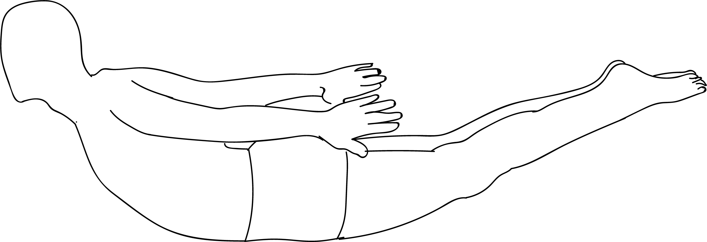

# Salabhasana

[TOC]

**Locust Pose** or **Salabhasana** is a simple backbend that strengthens the entire back of your body, from the nape of your neck to the backs of your heels. Salabhasana has benefits for a wide range of problems, including lower back pain, postural problems, and weakness anywhere along your back body, including your hips and hamstrings.

## Technique
1. Lie on your belly with your arms along the sides of your torso. Your palms should face up and your forehead should rest against the floor.
1. Turn your big toes toward each other to inwardly rotate your thighs, and firm your buttocks so that your tail bone (coccyx) presses toward your pubis.
1. Exhale and lift your head, upper torso, arms, and legs away from the floor. You will be resting on your lower ribs, belly, and the front of your pelvis.
1. Firm your buttocks and reach strongly through your legs, first through your heels to lengthen the muscles at the back of your legs, then through the bases of your big toes. Keep your big toes turned towards each other.
1. Raise your arms parallel to the floor and stretch back actively through your fingertips.
1. Imagine there’s a weight pressing down on the backs of your upper arms, and push up toward the ceiling against this resistance. Press your shoulder blades (scapulas) firmly into your back.
1. Gaze forward or slightly upward, being careful not to extend your chin forward and crunch the back of your neck.
1. Keep the base of your skull lifted and the back of your neck long.
1. Stay for 30 seconds to 1 minute in this position and then release with an exhalation.

## Technique in pictures/animation
## Effects
* The lower back and the spine are strengthened.
* It can make you much more flexible and agile.
* People who enjoy walking should definitely practice this asana. Walking long distances becomes much easier with the Salabhasana being practiced daily.
* Can help in refreshing fatigued people.
* Concentration is significantly enhanced.
* One can expect clear bowel movements if the Salabhasana is practiced regularly.

## Related Asanas
* [Bhujangasana](../yoga/Bhujangasana.md)
* [Gomukhasana](../yoga/Gomukhasana.md)
* [Setu Bandha Sarvangasana](../yoga/Setu_Bandha_Sarvangasana.md)
* [Supta Virasana](../yoga/Supta_Virasana.md)

## Special requisites
* If you are experiencing a headache or a migraine, or suffering from a neck or spinal injury, avoid this exercise.
* Pregnant women also must avoid this asana at all costs.

## Initial practice notes
Beginners can start by just lifting their legs, keeping their upper body on the ground. You may also use your hands for additional support.

## References

## External Links
* [Ananda Balasana on epainassist.com](https://www.epainassist.com/yoga/ananda-balasana-or-happy-baby-pose)
* [Ananda Balasana on rishikulyogshala.org](https://www.rishikulyogshala.org/top-10-health-benefits-of-ananda-balasana-happy-baby-pose/)
* [Ananda Balasana on yogicwayoflife.com](http://www.yogicwayoflife.com/ananda-balasana-happy-baby-pose/)

## References

1. ["Methodology"](https://thehealthorange.com/stay-fit/yoga/salabhasana-locust-pose-10-steps-benefits/)
2. [tips"]("Beginers)(http://www.stylecraze.com/articles/salabhasana-locust-pose/#Beginner’sTip)
3. [benefits"]("Health)(http://www.yogadaycelebration.com/salabhasana.html)
