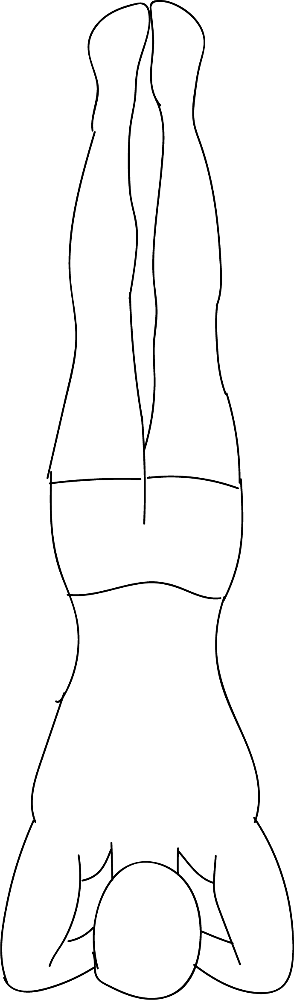

# Salamba Sirsasana I

[TOC]

**Salamba Sirsasana I** is an Asana. It is translated as Supported Headstand Pose I from Sanskrit. the name of this pose comes from **salamba** meaning **supported**, **sirsa** meaning **head** and **asana** meaning **posture** or **seat**. It is a variation of Sirsasana or Headstand Pose.

## Technique
1. Start off in Balasana (Child's Pose). Rest your head on either a blanket or a mat.
1. Now kneel on the floor and clasp your hands together. Place your head in between your fingers and rest your forearms on the ground/mat.
1. While inhaling, move off the floor and move your feet so that they are closer to your head. Your heels should be pointing upward and press your shoulder blades in to your back.
1. Now exhale and raise your legs perpendicular to the floor and keep your thighs turned inward slightly while doing this.
1. Press your tailbone firmly back against the base of your pelvis. Do not arch your back.
1. Stretch your legs upward.
1. This pose can be held about 10 seconds or longer depending on your comfort level.
1. Come out of this posture by exhaling and ensure that both your feet touch the floor at the same time.

## Technique in pictures/animation
## Effects
* It stimulates the pituitary and pineal glands.
* It strengthens the lungs.
* It improves digestion.
* It strengthens the spine and arms and legs.
* It helps to relieve the symptoms of menopause as well.
* It can relieve the buildup of fluid in the legs and feet.
* The pose lets healthy blood flow into the brain.

## Related Asanas
* [Adho Mukha Svanasana](../yoga/Adho_Mukha_Svanasana.md)
* [Salamba Sarvangasana](Salamba_Sarvangasana.md)

## Special requisites
* Do not practice this pose if you have either had a back or neck injury, suffer from headaches, have high blood pressure or low blood pressure or have an existing heart condition.
* This pose should not be performed while menstruating.
* It is not advisable to practice this pose while pregnant, unless you are familiar and quite experienced in doing this pose, before pregnancy.

## Initial practice notes
The beginner's tip for Supported Headstand involves practicing this pose against a wall. This prevents putting too much weight on the beginner's neck and head.

## References

## External Links
* [Salamba Sirsasana I on yogajournal.com](https://www.yogajournal.com/poses/challenge-pose-supported-headstand)
* [Salamba Sirsasana I on tummee.com](https://www.tummee.com/yoga-poses/salamba-sirsasana/steps)
* [Salamba Sirsasana I on astrolika.com](http://www.astrolika.com/yoga/salamba-sirsasana.html)

## References

1. ["Methodology"](http://www.yogawiz.com/Yoga-Poses/yoga-asanas/supported-headstand-salamba-sirsasana.html)
2. [tips"]("Beginers)(http://www.yogawiz.com/Yoga-Poses/yoga-asanas/supported-headstand-salamba-sirsasana.html)
3. [benefits"](https://www.boldsky.com/health/wellness/2016/salamba-sirsasana-supported-headstand-for-toning-abdominal-organs-103924.html"Health)
