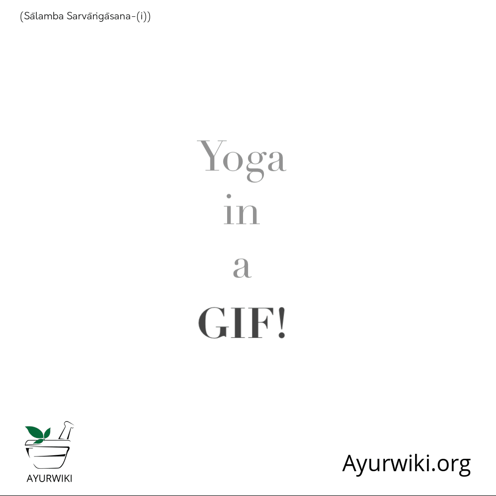

# Salamba sarvangasana

[TOC]

## Technique
1. Lie down on your back straight.
1. Breathe in and breathe out, lift your both legs in the upward direction.
1. Stop at that point when both legs make a 90-degree angle with the floor.
1. Make the Uttanpadasana Posture.
1. Sarvangasana-yoga-Steps
1. While exhaling lift your waist; push your legs back over the head.
1. Use your both hands for supporting waist.
1. Get your legs, back, and waist in one straight line.
1. Stretch your toes towards the sky, keep your eye on your toes.
1. Hold the position for some time, keep normal breathing.
1. Slowly get back to initial position.
1. Repeat this for three to four times.

## Technique in pictures/animation
## Effects
* Controls and cures the issues related to genital organs.
* Beneficial in constipation.
* Cures varicose veins and hemorrhoids.
* Useful in problems related to Ears, nose, and throat.
* Vivified the blood circulatory system, digestive system, and respiratory system.
* Freshen the thyroid gland; coz during pose lots of blood flows towards the throat.
* Cures for sexual disorders.
* Control and helps to restore seminal fluid loss through night wetting or Masturbation.
* Beneficial in Asthma, diabetes, liver disorders and intestinal disorders.
* Controls shrinking of skins and wrinkles in the face.

## Related Asanas
## Special requisites
## Initial practice notes
## References

## External Links
* [Salamba sarvangasana on yogatoday.com](https://www.yogatoday.com/poses/supported-shoulderstand)

* [Salamba sarvangasana on sequencewiz.org](http://sequencewiz.org/2014/01/14/how-to-sequence-a-class-for-the-shoulderstand-5-steps/)

## References

1. [Benefits"]("Health)(https://www.sarvyoga.com/sarvangasana-shoulders-stand-pose-steps-and-benefits/)
