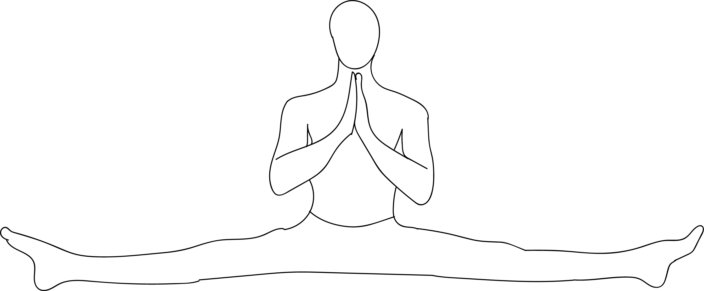

# Samakonasana

[TOC]

**Samakonasana** or **A split** is a physical position in which the legs are in line with each other and extended in opposite directions. Splits are commonly performed in various athletic activities, including dance, figure skating, gymnastics, martial arts, contortionism, synchronized swimming, cheerleading and yoga.

## Technique
1. Begin in Dandasana / Staff Pose.
1. Come into Prasarita Padottanasana / Wide-Legged Forward Bend.
1. Slowly open your legs as wide as you can. Try to make your legs perpendicular to your pelvis.
1. Rest your hands in front of you and straighten your spine. Take a deep breath in.
1. Join your palms in Pranam Mudra.
1. Stay in this pose for 3 to 6 long breaths.

## Technique in pictures/animation
## Effects
1. Calms the mind.
1. Stretches the hamstrings, groins, hips and spine.
1. Strengthens the back.
1. Stimulates the abdominal organs.
1. Recommended for people with sciatic pain and arthritis.

## Related Asanas
* [Adho Mukha Svanasana](../yoga/Adho_Mukha_Svanasana.md)

## Special requisites
* Anyone suffering from lower back, knee or hip injuries.
* Avoid during pregnancy.

## Initial practice notes
## References

## External Links
* [Samakonasana on yogapedia.com](https://www.yogapedia.com/definition/7197/samakonasana)
* [Samakonasana on stylesatlife.com](http://stylesatlife.com/articles/samakonasana/)
* [Samakonasana on yogavimoksha.com](https://www.yogavimoksha.com/samakonasana/)

## References

1. ["Methodology"](https://365dayspact.wordpress.com/2017/07/11/samakonasana-straight-angle-pose-stretching-is-good-for-you/)
2. [benefits"]("Health)(https://365dayspact.wordpress.com/2017/07/11/samakonasana-straight-angle-pose-stretching-is-good-for-you/)
