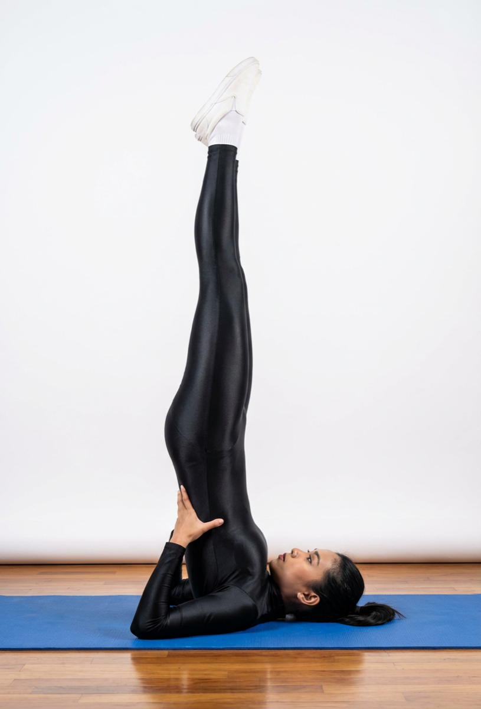

# Sarvangasana

[TOC]

**Sarvangasana** or Shoulderstand is an asana. Many variations of the Shoulderstand exist, the likely most common to be taught is Supported Shoulderstand. Sarvangāsana is nicknamed **queen** or **mother** all the asanas.

## Technique
1. Lie on your back with hands by your side.
1. With one movement, lift your legs, buttocks and back so that you come up high on your shoulders. Support your back with the hands.
1. Move your elbows closer towards each other, and move your hands along your back, creeping up towards the shoulder blades. Keep straightening the legs and spine by pressing the elbows down to the floor and hands into the back. Your weight should be supported on your shoulders and upper arms and not on your head and neck.
1. Keep the legs firm. Lift your heels higher as though you are putting a footprint on the ceiling. Bring the big toes straight over the nose. Now point the toes up. Pay attention to your neck. Do not press the neck into the floor. Instead keep the neck strong with a feeling of tightening the neck muscles slightly. Press your sternum toward the chin. If you feel any strain in the neck, come out of the posture.
1. Keep breathing deeply and stay in the posture for 30-60 seconds.
1. To come out of the posture, lower the knees to forehead. Bring your hands to the floor, palms facing down. Without lifting the head slowly bring your spine down, vertebra by vertebra, completely to the floor. Lower the legs to the floor. Relax for a minimum of 60 seconds.

## Technique in pictures/animation
## Effects
* The thymus gland is stimulated which boosts the immune system.
* It balances the parathyroid glands which ensures regeneration and normal development of the bones.
* It releases the normal gravitational pressure from the anus muscles which helps with haemorrhoids.
* The nerves passing through the neck are toned and the neck flexibility is increased.
* The digestive system is greatly improved due to the increase in blood circulation and drainage of stagnant blood.
* The pranic flow is harmonized, increasing energy and having a positive effect on all the body systems.
* Sarvangasana has all the benefits of Shirshasana but is safer and easier to perform.

## Related Asanas
* [Halasana](../yoga/Halasana.md)
* [Setu Bandha Sarvangasana](../yoga/Setu_Bandha_Sarvangasana.md)
* [Virasana](../yoga/Virasana.md)

## Special requisites
Avoid practicing this asana if you have the following conditions:

* Diarrhea
* Headache
* High blood pressure
* Menstruation
* Neck injury

## Initial practice notes
As a beginner, your elbows could slide apart, causing the upper arms to roll inwards. This could, in turn, cause the torso to sink onto the upper back, therefore, collapsing the pose and also causing the neck to strain.

## References

## External Links
* [Sarvangasana on arogyayogaschool.com](https://arogyayogaschool.com/blog/15-health-benefits-sarvangasana-shoulder-stand-yoga-pose/)
* [on gyanunlimited.com](http://www.gyanunlimited.com/health/top-10-health-benefits-sarvangasana-shoulder-stand/10786/Sarvangasana)
* [Sarvangasana on naturehomeopathy.com](https://www.naturehomeopathy.com/the-procedure-and-benefits-of-sarvangasana.html)

## References

1. ["Methodology"](https://www.artofliving.org/yoga/yoga-poses/shoulder-stand-sarvangasana)
2. [tips"]("Beginers)(http://www.stylecraze.com/articles/salamba-sarvangasana-shoulder-stand/#Beginner’sTip)
3. [benefits"]("Health)(https://www.yogapoint.com/asana/sarvangasana.html)
