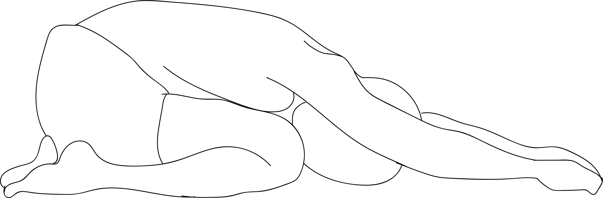

# Sasakasana

[TOC]

The word **Sasanka** in Sanskrit translates into a rabbit or a hare. As the name suggests, Sasankasana is a Yoga pose in which the posture of rabbit is mimicked. In the final position of the Sasankasana, the body resembles a leaping rabbit.

## Technique
1. Take the Vajrasana pose first.
1. Keep the knees on the ground and together, and rest your body on your heels.
1. While inhaling, raise both arms with palms facing outwards. Continue raising the arms until their insides touch your ears.
1. Start exhaling and at the same time, bend your pelvis and trunk in a forward direction till your arms touch the ground.
1. Stretch your palms out as much as possible, with your head facing down.
1. Maintain the position as long as it is possible in a comfortable manner.

## Technique in pictures/animation
## Effects
* It massages your heart automatically.
* It cures mental illness, irritability and stress too.
* One who daily perform it, can always be seen jolly and free-minded.
* It gives strength to pancreas, liver, kidneys and intestines.
* It reduces fat from waist, buttocks and thighs.
* It is a good thing for eased digestion.
* It keeps your body flexible and maintains the elasticity of the body.

## Related Asanas
* [Vajrasana](../yoga/Vajrasana.md)

## Special requisites
* Avoid practice of this pose if you suffer from vertigo, slipped disc, high blood pressure, and heart-related problems.

## Initial practice notes
* Perform this pose only when you are comfortable doing the Half Headstand.
* When you are coming out of the pose, you should always end with a slow inhalation as it can cause lightheadedness.

## References

## External Links
* [Sasakasana on stylesatlife.com](http://stylesatlife.com/articles/sasakasana/)
* [Sasakasana on yogabasics.com](http://www.yogabasics.com/asana/rabbit/)
* [Sasakasana on yogawiz.com](http://www.yogawiz.com/yoga-poses/hare-pose.html)

## References

1. ["Methodology"](http://www.yogadaycelebration.com/sasankasana.html)
2. [tips"]("Beginers)(http://www.yogawiz.com/yoga-poses/hare-pose.html)
3. [benefits"]("Health)(https://www.theayurveda.org/yoga/yogasana-for-anger-management-sasakasana)
