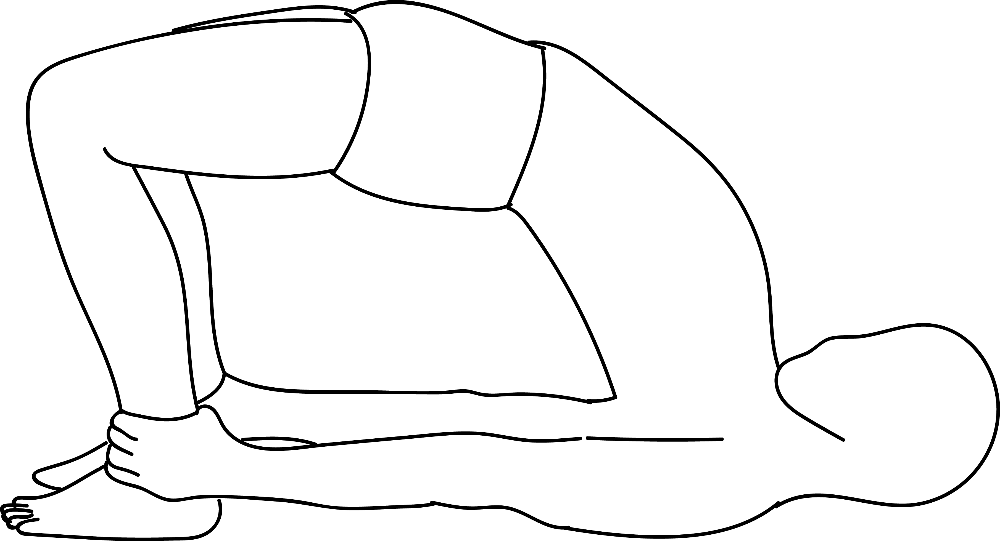

# Setu Bandha Sarvangasana

[TOC]

**Setu Bandha Sarvangasana** is an Asana. It is translated as **Supported Bridge Pose** from Sanskrit. The name of this pose comes from **setu** meaning **bridge**, **bandha** meaning **bound**, **sarvanga** meaning **full body**, and **asana** meaning **posture** or **seat**.

## Technique
1. Lie straight on your back on the floor.
1. Then bend the knees and keep the feet flat on the floor.
1. Press the arms on the floor and slowly lift the hips and back up from the floor.
1. Now with the support of your hands and shoulders lift up the upper back.
1. Hold the pose for at least 30-60 seconds.

## Technique in pictures/animation
## Effects
* Stretches the chest, neck, and spine
* Calms the brain and helps alleviate stress and mild depression
* Stimulates abdominal organs, lungs, and thyroid
* Rejuvenates tired legs
* Improves digestion
* Helps relieve the symptoms of menopause
* Relieves menstrual discomfort when done supported
* Reduces anxiety, fatigue, backache, headache, and insomnia
* Therapeutic for asthma, high blood pressure, osteoporosis, and sinusitis

## Related Asanas
* [Bhujangasana](../yoga/Bhujangasana.md)
* [Virasana](../yoga/Virasana.md)
* [Adho Mukha Svanasana](../yoga/Adho_Mukha_Svanasana.md)

## Special requisites
These are some points of caution you must keep in mind while you practice this asana:

* People who are suffering from a neck injury must either completely avoid this asana, or do it with a doctor’s permission under a certified yoga instructor.
* Pregnant women may do this asana, but not to the full capacity. They must do it under the guidance of a yoga expert. If they are in their third trimester, they must do this asana with a doctor’s consent.
* If you have back problems, you must avoid this asana.

## Initial practice notes
Beginners must keep in mind that when they roll their shoulders underneath, they must not pull them away forcefully from the ears. This will tend to overstretch their necks.

## References

## External Links
* [Setu Bandha Sarvangasana onwomenfitness.net](https://www.womenfitness.net/setu-bandha-sarvangasana/)
* [Setu Bandha Sarvangasana on yogajournal.com](https://www.yogajournal.com/poses/bridge-pose)
* [Setu Bandha Sarvangasana on yoga.ygoy.com](http://yoga.ygoy.com/2009/11/04/setu-bandha-sarvangasana-and-its-benefits/)

## References

1. ["Methodology"](http://www.yogaschoolblog.com/steps-bridge-bandha-sarvangasana-benefits/)
2. [tips"]("Beginers)(http://www.stylecraze.com/articles/setu-bandh-bridge-pose/#Beginner’sTips)
3. [benefits"]("Health)(https://www.yogajournal.com/poses/bridge-pose)
