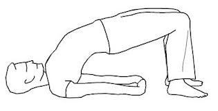

# Setu Bandhasana

[TOC]

**Setu Bandhasana** is an Asana. It is translated as **Bridge** from **Sanskrit**. The name of this pose comes from **setu** meaning **bridge**, **bandha** meaning **bound**, and **asana** meaning **posture** or **seat**.

## Technique
1. Lie flat on your yoga mat, with your feet flat on the floor.
1. Now exhale and push up, and off the floor with your feet.
1. Raise your body up such that your neck and head are flat on the mat, and the rest of your body is in the air. You can use your hands to push down for added support.
1. If you are flexible, you can even clasp your fingers just below your raised back for that added stretch. The key here is not to overexert or hurt yourself while doing this pose.

## Technique in pictures/animation
## Effects
* Stretches the chest, neck, spine, and hips
* Strengthens the back, buttocks, and hamstrings
* Improves circulation of blood
* Helps alleviate stress and mild depression
* Calms the brain and central nervous system
* Stimulates the lungs, thyroid glands, and abdominal organs
* Improves digestion
* Helps relieve symptoms of menopause
* Reduces backache and headache
* Reduces fatigue, anxiety, and insomnia

## Related Asanas
* [Bhujangasana](../yoga/Bhujangasana.md)
* [Virasana](../yoga/Virasana.md)
* [Adho Mukha Svanasana](../yoga/Adho_Mukha_Svanasana.md)

## Special requisites
These are some points of caution you must keep in mind while you practice this asana:

* People who are suffering from a neck injury must either completely avoid this asana, or do it with a doctor’s permission under a certified yoga instructor.
* Pregnant women may do this asana, but not to the full capacity. They must do it under the guidance of a yoga expert. If they are in their third trimester, they must do this asana with a doctor’s consent.
* If you have back problems, you must avoid this asana.

## Initial practice notes
Beginners must keep in mind that when they roll their shoulders underneath, they must not pull them away forcefully from the ears. This will tend to overstretch their necks.

## References

## External Links
* [Setu Bandhasana on gyanunlimited.com](http://www.gyanunlimited.com/health/setu-bandhasana-bridge-pose-top-10-best-health-benefits/11399/)
* [Setu Bandhasana on artofliving.org](https://www.artofliving.org/yoga/yoga-poses/bridge-posture-setu-bandhasana)
* [Setu Bandhasana  on spotebi.com](https://www.spotebi.com/exercise-guide/bridge-pose/)

## References

1. ["Methodology"](https://arogyayogaschool.com/blog/health-benefits-of-bridge-pose-setu-bandhasana/)
2. [tips"]("Beginers)(http://www.stylecraze.com/articles/setu-bandh-bridge-pose/#Beginner’sTips)
3. [benefits"]("Health)(http://www.cnyhealingarts.com/2011/01/21/the-health-benefits-of-setu-bandhasana-bridge-pose/)
