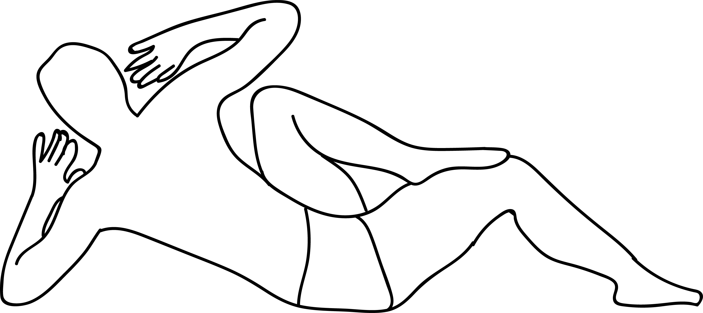

# Shatkonasana

[TOC]

**Shatkonasana** is an Asana. It is translated as ***Six Triangles Pose*** from **Sanskrit**.

The name of this pose comes from "shat" meaning "six", "kona" meaning "angle", and "asana" meaning "posture" or "seat".

## Benefits
This pose strengthens the abdominals and stimulates the internal organs.

## Cautions
* Be careful while doing this pose if you have any spinal injuries.
