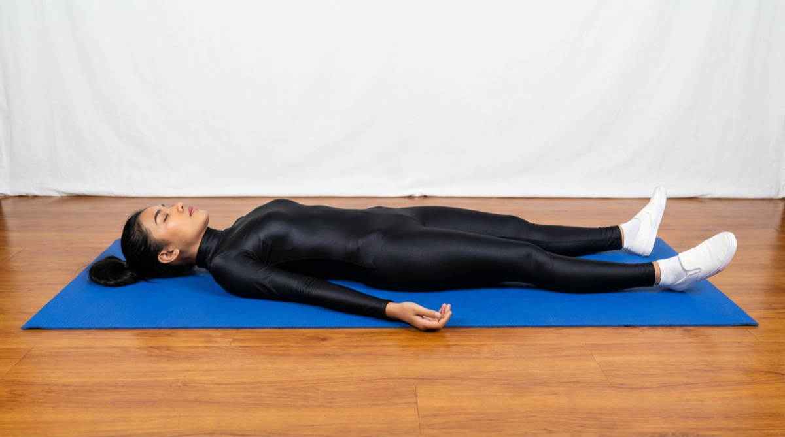

# Shavasana

[TOC]

The name comes from the Sanskrit words Shava meaning **corpse**, and Asana meaning **posture** or **seat**. Yoga is a system of mental and physical training. It consists of postures, breathing exercises, meditations, which claim to give knowledge of reality. Relaxation and meditation are also key components, shavasana and sitting postures maintain the balance by their equal input of physical stimuli.

## Technique
1. Lying flat on your back, like our sleeping posture Leg should be different
1. Keep your hands in your side and face your palms. Take rest.
1. Close your eyes and breathe deeply and slowly through the nose.
1. Start focusing from your head to your feet. This means that you are deliberately resting each part of the body. Go ahead without special parts of the body.
1. Each breathes and breathes (breathing) that your body is completely resting. Let’s run away on exhaling your stress, stress, depression and anxiety.
1. People with good concentrations can practice for a long time and others can practice for 3-5 minutes.

## Technique in pictures/animation
## Effects
* It relaxes your whole body.
* Releases stress, fatigue, depression and tension.
* Improves concentration.
* Cures insomnia.
* Relaxes your muscles.
* Calms the mind and improves mental health.
* Excellent asana for stimulating blood circulation.

## Related Asanas
* [pranayama](pranayama.md)

## Special requisites
* This asana is absolutely safe and can be practiced by anyone and everyone. Unless your doctor has advised you not to lie on your back, you can practice this asana.

* If you are pregnant, it might be a good idea to rest your head and chest on a bolster for comfort.

## Initial practice notes
In our busy, stressful lives, it can be quite a task to completely let go and relax. The most difficult part about Shavasana is to release the heads of the thigh bones so that the groin softens.

This is one of the Asanas prescribed in [Hatha Yoga Pradipika](Hatha_Yoga_Pradipika_(book).md).

## References

## External Links
* [Shavasana on thehealthorange.com](https://thehealthorange.com/stay-fit/yoga/how-to-do-savasana-corpse-pose-in-13-steps-its-benefits/)
* [Shavasana on doyouyoga.com](https://www.doyouyoga.com/the-holistic-benefits-of-savasana-57950/)
* [Shavasana on artofliving.org](https://www.artofliving.org/in-en/yoga/yoga-poses/shavasana-corpse-pose)

## References

1. ["Methodology"](https://arogyayogaschool.com/blog/health-benefits-of-corpse-pose-shavasana/)
2. [tips"]("Beginers)(http://www.stylecraze.com/articles/shavasana-corpse-pose/#BiginnersTip)
3. [benefits"]("Health)(https://eyogaguru.com/shavasana-savasana-yoga-corpse-pose-benefits-and-steps/)
