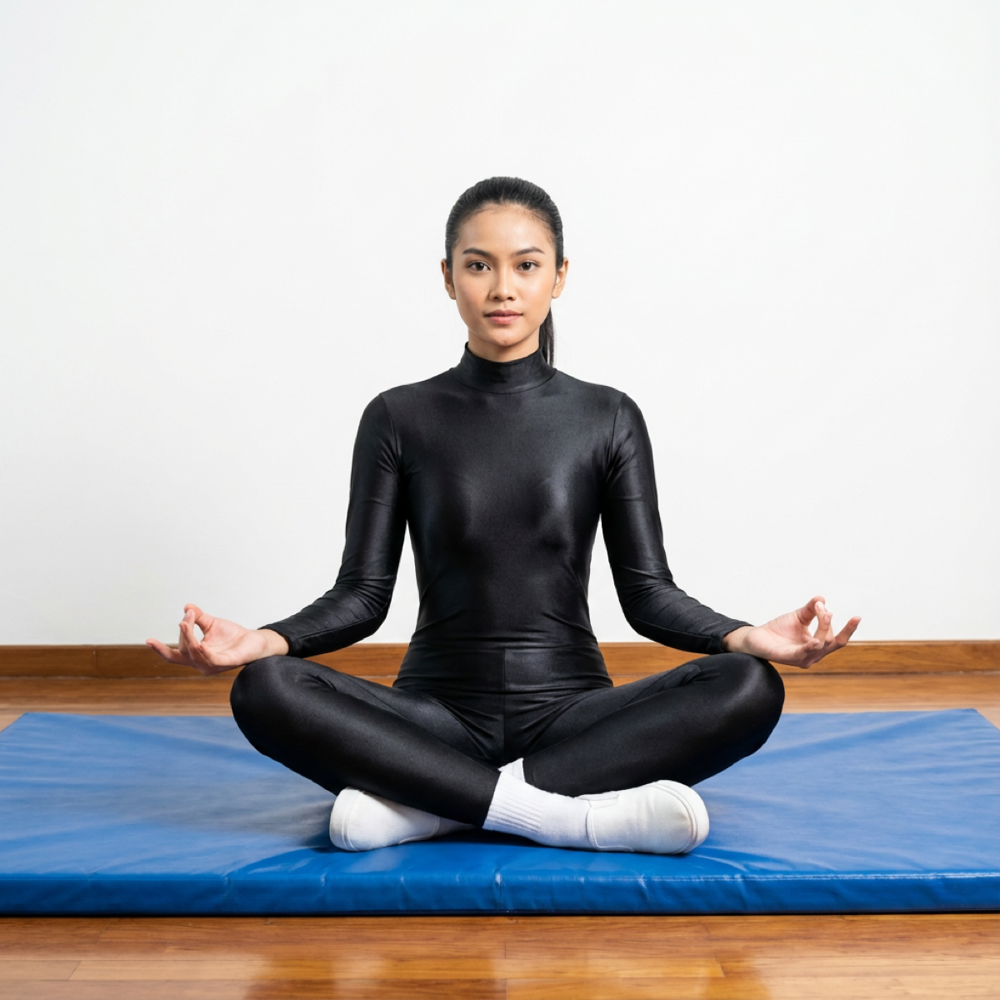

# Siddhasana

[TOC]

**Siddhasana** or the accomplished pose is an asana used for meditation and other yogic practices. In Sanskrit **Siddha** means **accomplished** or an **adept** and **asana** means a **pose**.

This is one of the Asanas prescribed in [Hatha Yoga Pradipika](Hatha_Yoga_Pradipika_(book).md).

## Technique
1. Sit down on the floor or your yoga mat and keep your legs at a close distance from each other.
1. The left foot should be first placed at the perineum, a soft tissue situated between the testes and the anus. For females, the corresponding area would be the labia majora.
1. Place the right foot over the left.
1. Make sure that the knees are in contact with the ground.
1. Keep your spine straight and press your chin against your chest.
1. Concentrate on your breathing, and maintain the pose for as long as comfortably possible.

## Technique in pictures/animation
## Effects
* It is one of the important Asana used for meditation. One can maintain this position for a long duration.
* Makes spinal column straight and steady.
* In Siddhasana, the heel is kept pressed against the Muladhara This ensures that the energy currents flow upwards towards the spine.
* This Asana gives the control over sex urge and the sexual functions.
* It stabilizes the nervous system.

## Related Asanas
* [Padmasana](../yoga/Padmasana.md)

## Special requisites
* The people having certain ailments or physical problems must avoid doing it. For example the pose is not recommended for those who have recently had any surgery related especially on the back or hip.
* The people those who are suffer from lower back pain and sciatica must not perform this asana.
* People with recent knee injuries or other knee pain, arthritis should not do this asana.

## Initial practice notes
Some new yogi may feel uncomfortable during this asana, so it is important that the person feel comfortable in initial stage of Siddhasana. They can make some modifications they require to feel firm, confident and can get some support to perform the pose. Below are some suggestions which you can use to accomplish Siddhasana.

## References

## External Links
* [Siddhasana on yogicwayoflife.com](http://www.yogicwayoflife.com/siddhasana-the-accomplished-pose/)
* [Siddhasana on  ayurvedicindia.info](http://www.ayurvedicindia.info/yoga-postures-siddhasana/)
* [Siddhasana on yogawiz.com](http://www.yogawiz.com/yoga-poses/accomplished-pose.html)

## References

1. ["Methodology"](http://www.yogadaycelebration.com/siddhasana.html)
2. [tips"]("Beginers)(http://www.ayurvedicindia.info/yoga-postures-siddhasana/)
3. [benefits"]("Health)(https://www.sarvyoga.com/siddhasana-the-accomplished-pose-steps-and-benefits/)
