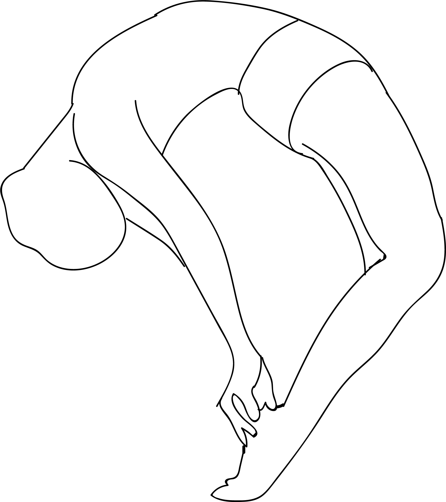

# Stiti Urdhva Mukgattana Kulpa Dhanurasana

[TOC]

**Stiti Urdhva Mukgattana Kulpa Dhanurasana** is an Asana. It is translated as ***Standing Upward Facing Intense Ankle Stretch Bow Pose*** from **Sanskrit**.

The name of this pose comes from "stit" meaning "standing", "urdhva" meaning "upward", "mukha" meaning "face", "uttana" meaning "intense stretch", "kulpa" meaning "ankle", "dhanu" meaning "bow", and "asana" meaning "posture" or "seat".

## Benefits
1. It stretched the chest and front shoulders.
1. Stretches the ankles and the front of the body.
1. Promotes spinal flexibility and balance.

## Cautions
* Be careful while doing this pose if you have any spinal, shoulder, ankle, or knee injuries.
