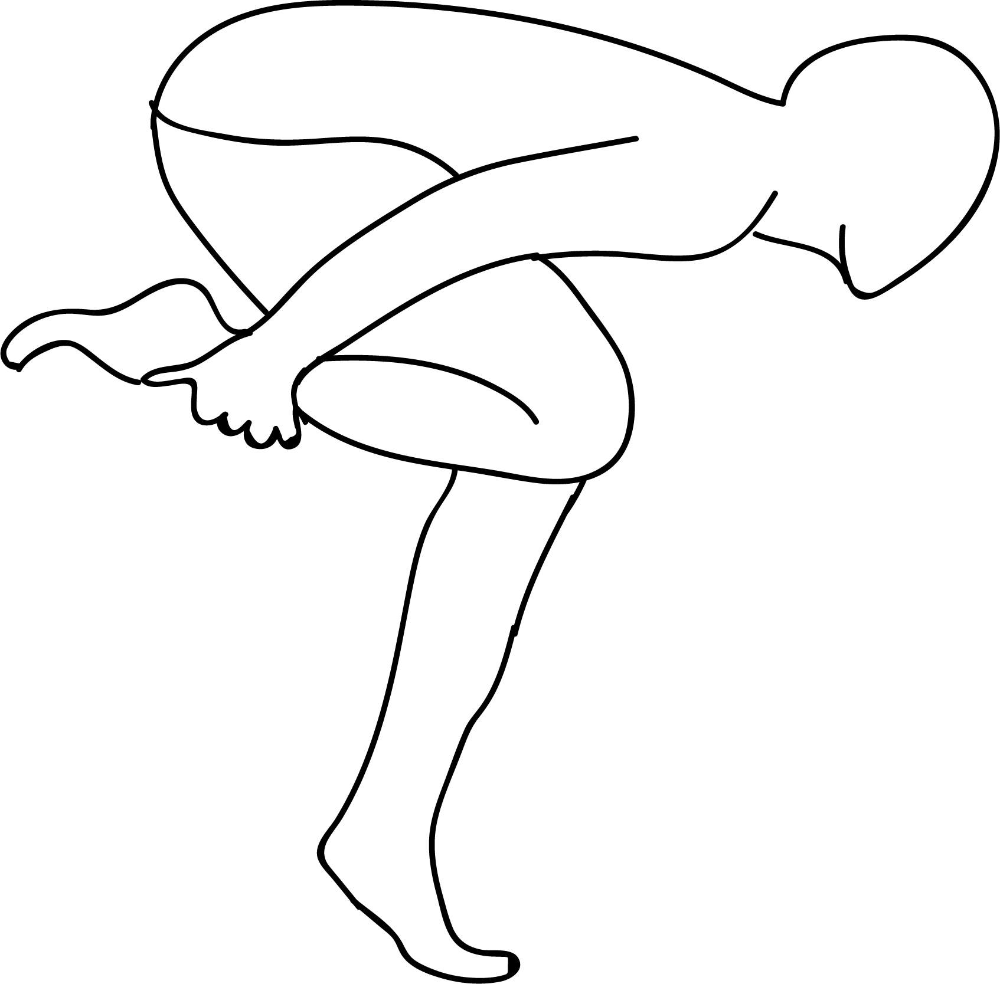

# Stiti Vayu Muktyuttonasana

[TOC]

**Stiti Vayu Muktyuttonasana** is an Asana. It is translated as **''Standing Wind Relieving Intense Stretch Pose** from **Sanskrit**.

The name of this pose comes from "stiti" meaning "standing", "vayu" meaning "wind", "mukta" meaning "free", "uttana" meaning "intense stretch", and "asana" meaning "posture" or "seat".

## Benefits
1. It promotes a sense of balance.
1. While stretching the front of the hip and lower back.

## Cautions
Be careful while doing his pose if the balance is an issue, or if you have any hip or lower back injuries.
