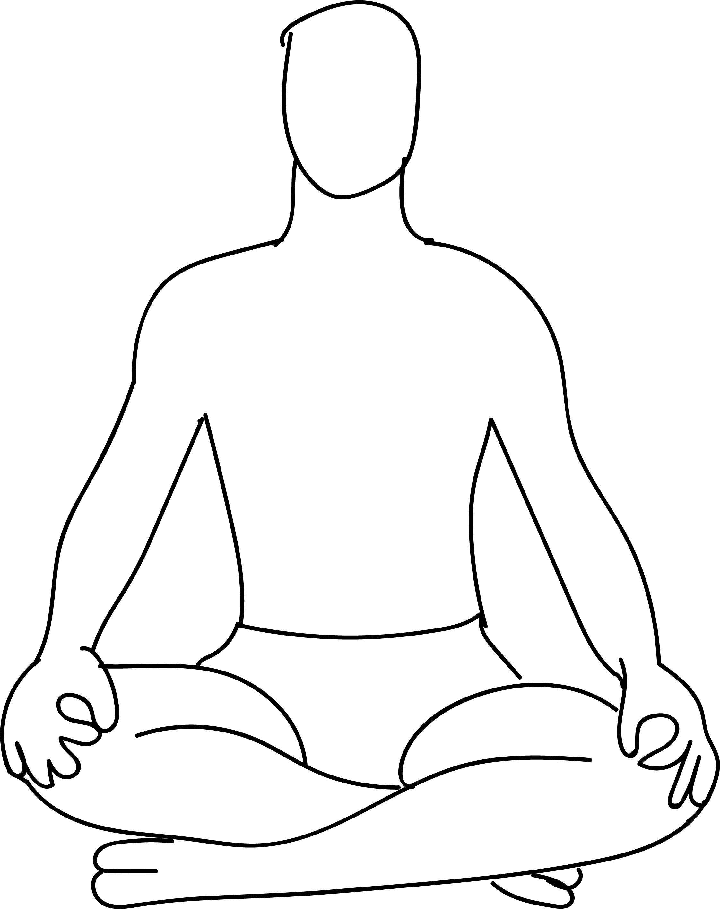

# Sukhasana

[TOC]

The Sukhasana is very simple to perform for people of all ages and levels of physical wellness. The term **Sukhasana** is gotten from the Sanskrit word **Sukham** which signifies **delight** or **bliss** and **asana** signifies **posture**.

## Technique
1. Sit on the floor with legs stretched out. Always use a yoga mat or a cushion or a carpet while sitting on the floor.
1. Fold the left leg and tug it inside the right thigh.
1. Then fold the right leg and tug in inside the left thigh.
1. Keep the hands on the knees. Jnana mudra or Chin mudra can be used if you are using this posture for meditation.
1. Sit erect with spine straight.
1. Relax your whole body and breathe normally.
1. Maintain this position for as long a comfortable.

## Technique in pictures/animation
## Effects
* Gradually strengthens muscles of the back and improves body posture.
* Being a meditative pose it has relaxing effects on mind and body.
* Works as a preparatory pose for more difficult meditative poses.
* Builds physical and mental balance.
* Helpful in reducing stress and anxiety.
* Excellent for people having a stiff body.
* Creates flexibility in ankle, knee and hip joints.
* Improves concentration for achieving an effective meditation practice.

## Related Asanas
* [Dandasana](../yoga/Dandasana.md)

## Special requisites
* Avoid this asana if you have hip and knee injuries, or if they are both inflamed.
* Practice caution if you have a slipped disc problem. You could use cushioning to make the pose comfortable.

## Initial practice notes
As a beginner, it might be difficult to sit erect on the floor for a long time. You can use blocks and cushioning to get the posture right. You can also lean against the wall to keep your back erect.

## References

## External Links
* [Sukhasana on doyouyoga.com](https://www.doyouyoga.com/6-holistic-benefits-of-sukhasana-85637/)
* [Sukhasana on easyayurveda.com](https://easyayurveda.com/2018/03/19/sukhasana-easy-decent-pleasant-comfort-pleasure-pose/)
* [Sukhasana on yogajournal.com](https://www.yogajournal.com/poses/easy-pose)

## References

1. ["Methodology"](http://www.yogicwayoflife.com/sukhasana-the-easy-sitting-pose/)
2. [tips"]("Beginers)(http://www.stylecraze.com/articles/sukhasana-easy-pose/#Beginner’sPose)
3. [benefits"]("Health)(http://www.finessyoga.com/yoga-asanas/sukhasana-easy-pose-steps-precautions-benefits)
