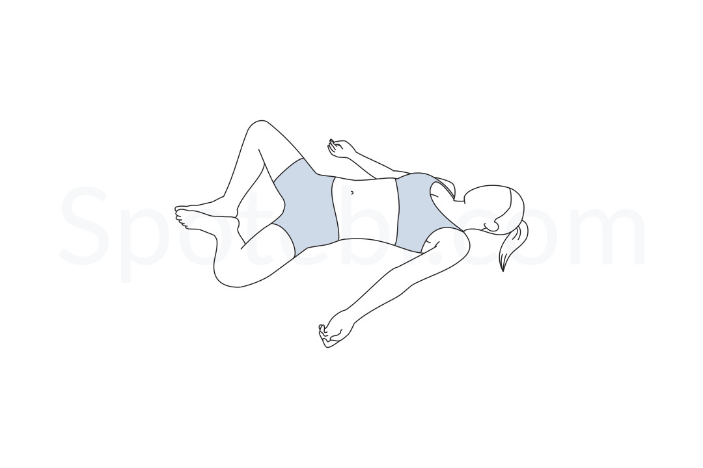

# Supta Baddha Konasana

[TOC]

**Supta Baddha Konasana** is an Asana. It is translated as **Reclined Bound Angle Pose** from **Sanskrit**. The name of this pose comes from **supta** meaning **reclined**, **baddha** meaning **bound**, **kona** meaning **angle** and **asana** meaning **posture** or **seat**. It is a reclined (supine) variation of Baddha Konasana.

## Technique
1. Lie down on the back.
1. Bend the knees and bring the soles of the feet together.
1. Drag the soles along the floor and bring them as close as possible to the body. Stay in this position as long as comfortably can.
1. Use an eye bag, if you have one, to gently massage the muscles around the eyes to relax and let go.
1. Take a couple of long, slow inhales and exhales. Wish to remain here as long as 30 minutes in a deep, restorative practice.

## Technique in pictures/animation
## Effects
* Lowered blood pressure
* A decreased heart rate
* Decreased muscle tension
* Reduced occurrence of headaches
* Relief from fatigue and insomnia
* Reduced nervous tension and stress
* Relief from anxiety and panic attacks
* Increased overall energy levels

## Related Asanas
* [Adho Mukha Svanasana](../yoga/Adho_Mukha_Svanasana.md)

## Special requisites
Avoid practicing this asana if you have the following problems:
* Knee injuries
* Groin injuries
* Pain in the lower back
* Shoulder injury
* Hip injury
* Pregnant women must do this asana under the supervision of an instructor. They must also always keep their chest and head raised while in this position.
* Women who have just delivered must avoid this pose for about eight weeks, or until the muscles in the pelvic region are firm.

## Initial practice notes
As a beginner, you might feel a strain in your groin and inner thighs as you practice this asana. To deal with this, gently raise your feet slightly off the floor until you get comfortable.

## References

## External Links
* [Supta Baddha Konasana on yogicwayoflife.com](http://www.yogicwayoflife.com/supta-baddha-konasana-bound-angle-reclined-pose/)
* [Supta Baddha Konasana on spotebi.com](https://www.spotebi.com/exercise-guide/reclining-bound-angle-pose/)
* [Supta Baddha Konasana on yogajournal.com](https://www.yogajournal.com/poses/reclining-bound-angle-pose)

## References

1. ["Methodology"](http://healthy-ojas.com/systems/supta-baddha-konasana.html)
2. [tips"]("Beginers)(http://www.stylecraze.com/articles/amazing-benefits-of-supta-baddha-konasana-for-leading-a-healthy-life/#Beginner’sTip)
3. [benefits"]("Health)(https://www.yogaoutlet.com/guides/how-to-do-reclined-bound-angle-pose-in-yoga)
