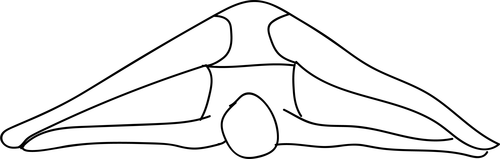

# Supta Konasana

[TOC]

**Supta Konasana** is an Asana. It is translated as **Reclined Angle Pose** from **Sanskrit**. The name of this pose comes from **supta** meaning **reclined**, **kona** meaning **angle**, and **asana** meaning **posture** or **seat**.

## Technique
1. Start by placing some blankets on the floor, folded neatly. These folded blankets will support your neck and shoulders.
1. Lie on these blankets with your neck and legs on the floor while the shoulders on the folded blankets. Your legs need to be folded at the knee with feet flat on the ground.
1. Lift your hips and legs to take your legs overhead and spread them wide apart.
1. Lock your fingers behind your back and roll your shoulders down, pushing your feet down to the floor over your head. Your toes should be touching the floor.
1. You can use your interlocked fingers to push your ribs up, raising your back further. You can also try and grasp your toes over your head.

Hold this position for 20 to 30 seconds and slowly come back to the starting pose.
In this reclining angle pose, you can also go into the halasana or the plough pose or the parshva halasana or the side plough pose.

## Technique in pictures/animation
## Effects
* Tones the legs
* Improves digestion
* Stimulate thyroid gland, helping with metabolic problems
* It stretches the spine, the legs, the back, the arms, thighs and calves.
* It makes the neck, face and eyes and throat flexible.
* Improves your concentration.

## Related Asanas
* [Baddha Koṇāsana](Baddha_Koṇāsana.md)
* [Virasana](../yoga/Virasana.md)
* [Vrikshasana](Vrikshasana.md)
* [Supta Padangusthasana](../yoga/Supta_Padangusthasana.md)

## Special requisites
* Avoid this pose if you have any chronic pain or injuries of the neck, back or the legs.
* If you practice yoga regularly, then you might want to do this pose with an instructor or with guidance till your pain recedes.
* People who have injuries like those of whiplash or disc degeneration should do this pose very carefully.

## Initial practice notes
As a beginner, you might feel a strain in your groin and inner thighs as you practice this asana. To deal with this, gently raise your feet slightly off the floor until you get comfortable.

## References

## External Links
* [Supta Konasana on befityoga.com ](https://www.befityoga.com/2011/08/supta-konasana/)
* [Supta Konasana on yogapedia.com](https://www.yogapedia.com/definition/8015/supta-konasana)
* [Supta Konasana on 365dayspact.wordpress.com](https://365dayspact.wordpress.com/2017/06/07/supta-konasana-the-reclining-angle-pose-stretching-is-good-for-you/)

## References

1. ["Methodology"](http://www.yogawiz.com/yoga-poses/yoga-asanas/reclining-angle-pose.html)
2. [tips"]("Beginers)(http://www.stylecraze.com/articles/amazing-benefits-of-supta-baddha-konasana-for-leading-a-healthy-life/#Beginner’sTip)
3. [benefits"]("Health)(http://pranayoga.co.in/asana/supta-konasana-reclining-angle-posture/)
