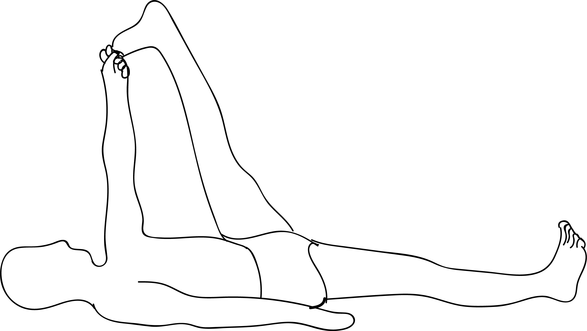

# Supta Padangustasana I

[TOC]

**Supta Padangustasana I** is an Asana. It is translated as Reclined (Hand to) Big Toe Pose I from Sanskrit. The name of this pose comes from **supta** meaning **reclined**, **pada** meaning **leg** or **foot**, **angusta** meaning **big toe**, and **asana** meaning **posture** or **seat**.

## Technique
1. Lie on your back, legs extended, feet flexed pressing out through the heels.
1. On an exhalation draw the right knee into your chest, loop a strap around the arch of the right foot, or hook your first two fingers around your big toe if you have the flexibility.
1. Straighten and extend the right leg up to the ceiling until the arms are straight keeping shoulders pressing in the floor.
1. Keep strongly extending through the left leg pressing the top of the left thigh down (with your hand) and extend through the right heel creating a comfortable stretch in the back of the leg.
1. Stay here or turn the right leg out and bring the leg down towards the floor on your right side. Keep the left hip grounded to the floor rather than bringing your leg further out.
1. Stay in each variation for 5 breaths or up to three minutes - repeat on the other side.

## Technique in pictures/animation
## Effects
* helps recovery from a cardiac condition
* removes stiffness in the lower back and relief backache by helping to align the pelvic area
* prevents Hernia
* helps to treat osteoarthritis of the hip and the knees by stretching the hamstrings and calf muscles and strengthening the knees
* strengthen the hip joint and tone the lower spine
* relieves sciatic pain
* Helps to relieve menstrual discomfort

## Related Asanas
* [Adho Mukha Svanasana](../yoga/Adho_Mukha_Svanasana.md)
* [Baddha Konasana](Baddha_Konasana.md)
* [Uttanasana](../yoga/Uttanasana.md)

## Special requisites
* Avoid doing this asana if you have a headache or diarrhea.
* If you have blood pressure, raise your head and neck using a folded blanket, and then practice the asana.

## Initial practice notes
As a beginner, you must practice this asana with the heel of the bottom leg pressed against a wall.

## References

## External Links
* [Supta Padangustasana I on yogajournal.com](https://www.yogajournal.com/practice/supta-padangusthasana-2)
* [Supta Padangustasana I on stylesatlife.com](http://stylesatlife.com/articles/supta-padangusthasana/)
* [Supta Padangustasana I on tummee.com](https://www.tummee.com/yoga-poses/reclined-big-toe-pose-a/benefits)

## References

1. ["Methodology"](https://www.ekhartyoga.com/more-yoga/yoga-poses/reclining-big-toe-pose#)
2. [tips"]("Beginers)(http://www.stylecraze.com/articles/supta-padangusthasana-reclining-big-toe-pose-and-its-benefits/#Beginner’sTip)
3. [benefits"]("Health)(http://www.liveyoga.nl/yoga-library/yoga-postures/yoga-pose-supta-padangusthasana-i-ii/)
