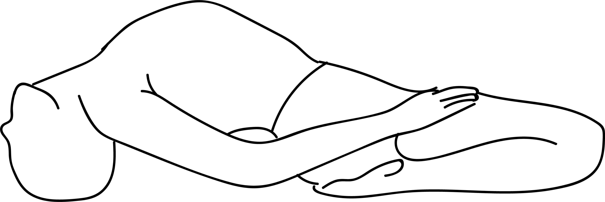

# Supta Vajrasana

[TOC]

**Suptavajrasana** is an Asana. It is translated as **Reclining Thunderbolt Pose** from **Sanskrit**. The name of this pose comes from **supta** meaning **reclining**, **vajra** meaning **thunderbolt** and **asana** meaning **posture** or **seat**.

## Technique
1. Sit comfortably in Vajrasana.
1. Keeping your palms on the floor beside the buttocks, your fingers pointing to the front.
1. Slowly bend back, putting the proper forearm and also the elbow on the bottom so the left.
1. Slowly bring down your head to the ground while arching the back. Place your hands on the thighs.
1. Try to stay the lower legs connected with the ground. If necessary, separate the knees.
1. Make certain that you simply don’t seem to be overstraining the muscles and ligaments of the legs.
1. Close the eyes and relax the body.supta-vajrasan_steps
1. Breathe deeply and slowly within the final position.
1. Release within the reverse order, inhaling and taking the support of the elbows and also the arms raise the top higher than the bottom.
1. Then shift the weight on the left arm and elbow by slippery the body, then slowly returning to the beginning position.
1. Never leave the ultimate position by straightening the legs first; it’s going to dislocate the knee joints.

## Technique in pictures/animation
## Effects
* Supta vajrasana stretches the abdominal and thoracic muscles.
* It relieves constipation.
* It strengthens the thigh muscles.
* It can strengthen the sacral region and brings flexibility to the back, but those suffering from sacral pain should avoid this asana.
* It brings flexibility of the spine.
* It is a good counter-pose for forward bending asanas.

## Related Asanas
* [Vajrasana.](Vajrasana..md)

## Special requisites
* Pregnant women must avoid practicing Supta Vajrasana.
* To release the pose, never straighten the legs first. That may result into dislocation of the knee joints.
* This pose is not meant to be practiced by the people suffering from: sciatica, neck and knee problems, spine ailments, slipped disc.

## Initial practice notes
## References

## External Links
* [Suptavajrasana on astrogle.com](https://www.astrogle.com/yoga/supta-vajrasana-reclined-thunderbolt-pose-procedure-and-benefits.html)
* [Suptavajrasana on yogaindailylife.org](https://www.yogaindailylife.org/system/en/level-4/supta-vajrasana)
* [Suptavajrasana on yogapedia.com](https://www.yogapedia.com/definition/8173/supta-vajrasana)

## References

1. ["Methodology"](https://www.sarvyoga.com/supta-vajrasana-reclined-thunderbolt-pose-steps-benefits/)
2. [benefits"]("Health)(http://www.yogicwayoflife.com/supta-vajrasana-supine-thunderbolt-pose/)
