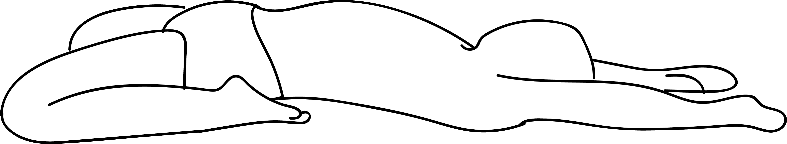

# Supta Virasana

[TOC]

**Supta Virasana** is the Sanskrit name for The Reclined Hero Pose. **Supta** means **Lying Down**, **Vira** means **An eminent man or Hero** and **Asana** means **Pose**. Supta Virasana is pronounced as **Soup-tah veer-AHS-anna**.

## Technique
1. Begin in a high kneeling position.
1. Separate your feet wide enough so that you can sit your hips between them.
1. Place a block, a bolster, or a folded blanket between your feet and ankles if your hips are away from the floor, or if your knees are under pressure.
1. Your feet should be just outside your hips, the tops of your feet pressing into the floor, and your toes pointing backwards.
1. Make sure your knees don’t splay out wider than your hips.
1. Recline backwards by first walking back onto your hands, then your elbows, and then if it feels comfortable, onto your back.
1. If you feel discomfort in your knees or lower back, or if your knees lift significantly off of the floor, back out of the pose and come more upright.
1. For more support, sit on a block or a blanket folded to about the size of a block and support your middle and upper back, neck, and head with a bolster or blankets.

## Technique in pictures/animation
## Effects
* The quadriceps is stretched.
* It also helps the digestive system to function better and improves digestion.
* It helps to strengthen the arches.
* The tendons, ligaments and many smaller muscles in the knee are also stretched during this posture.
* It helps to relieve tired legs.
* This pose is also useful as it helps to relieve menstrual pain symptoms.
* It stretches the abdomen, ankles, deep hip flexors and thighs as well.

## Related Asanas
* [Baddha Konasana](Baddha_Konasana.md)
* [Balasana](../yoga/Balasana.md)
* [Bhujangasana](../yoga/Bhujangasana.md)
* [Gomukhasana](../yoga/Gomukhasana.md)
* [Virasana](../yoga/Virasana.md)

## Special requisites
It is essential to practice this pose correctly to avoid injury.

* If you are suffering from a neck injury, it might be a good idea to use a thickly folded blanket to support the head.
* You must ensure your spine is absolutely straight while practicing this asana to avoid any kind of injury.
* Pregnant women and women who are menstruating must avoid practicing this asana.
* People suffering from high blood pressure and knee injuries should also avoid this asana.

## Initial practice notes
As a beginner, you might find your thighs sliding apart in this pose. To avoid this, use a strap to bind your thighs together, or squeeze a thick book between your thighs. However, these are only short-term solutions.

## References

## External Links
* [Supta Virasana on easyayurveda.com](https://easyayurveda.com/2018/03/25/supta-virasana-reclined-hero-pose/)
* [Supta Virasana on sarvyoga.com](https://www.sarvyoga.com/supta-virasana-reclining-hero-pose-steps-and-benefits/)
* [Supta Virasana on tiffanywoodyoga.com](https://tiffanywoodyoga.com/blog/the-benefits-of-supta-virasana-reclining-hero-yoga-pose)

## References

1. ["Methodology"](https://arogyayogaschool.com/blog/health-benefits-of-supta-virasana-reclined-hero-pose/)
2. [tips"]("Beginers)(http://www.stylecraze.com/articles/supta-virasana-how-to-do-and-what-are-its-benefits/#Beginner’sTips)
3. [benefits"]("Health)(http://www.yogawiz.com/yoga-poses/yoga-asanas/reclining-hero-pose.html)
