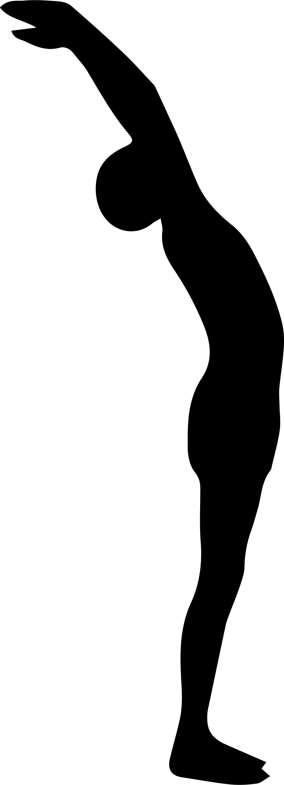
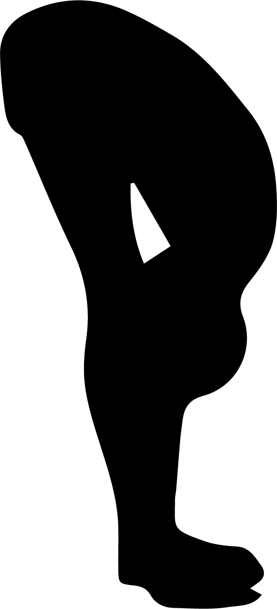
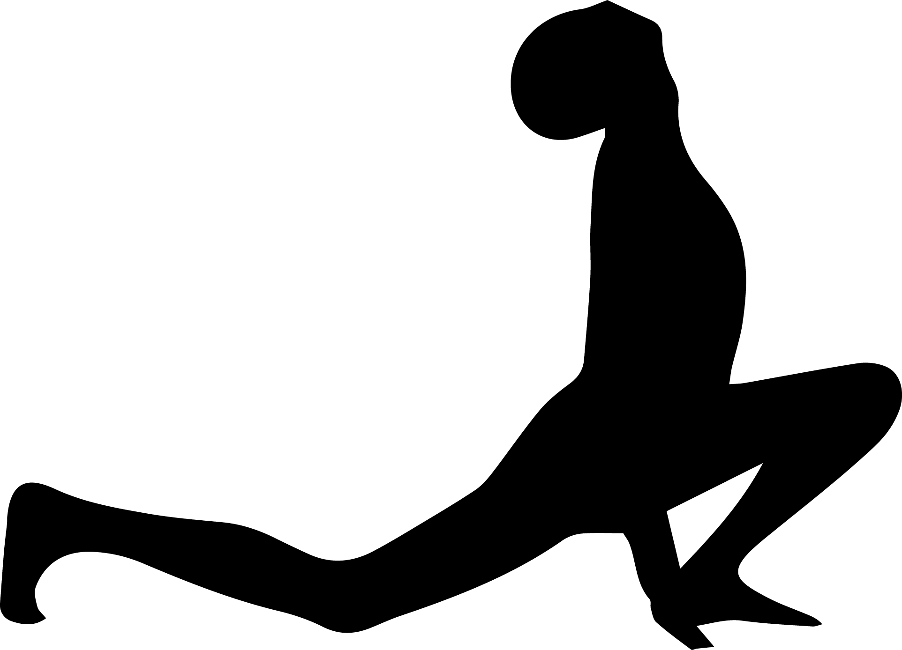
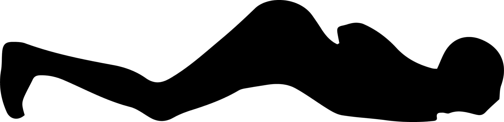
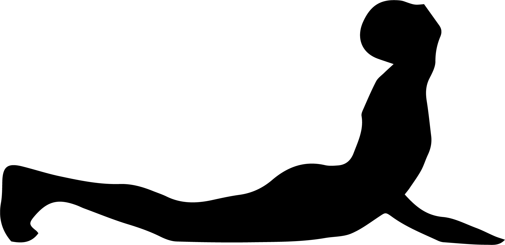
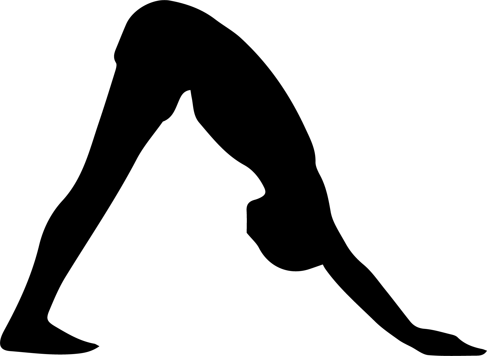

# Surya Namaskara

[TOC]

Surya worship is performed through mantra japa, namaskara and pranayama.
Ayurveda says surya is the giver of health. Hence surya worship assume great importance.
Life is possible on this small planet of ours only because of the sun. The sun radiates energy which enables life to stir and grow in the seas, on land and in the air. Without the sun all life ceases to be. The awe inspiring natural phenomena is because of the sun in the form of day and night. rain and cloud, fog or rainbow.The sun provides abundant crops, fruits, vegetables and flowers and made our life comfortable. Because of sun we get heat and light - therefore energy. All creation is suffered with energy that binds the atoms and molecules in a piece of wood is the same as that which animates in a living organism. Life and all human activity is a manifestation of the same energy; which informs and sustain the entire universe. Indian rishis and sages believed that it is the energy of consciousness that started the whole process pf creation. By performing simple experiments with our body, breath and mind we can discover where the energy, joy and love, and this is where surya namaskara-s some in. Surya namaskara-s are obeisance to the sun, that source of primal and eternal energy, takes yogic the form 12 yogic asanas or postures, performed in a sequence of movements. Breath and sound are made to flow simultaneously, easily, gracefully and rhythmically in this technique of receiving and utilising cosmic energy. Surya namaskara-s do not belong any religion. They are not part of any religious activity or ritual in the narrow sense of the term. But they have in them a deep spiritual content and open up a new profound and powerful dimension of awareness and  as all religious and spiritual y and experiences always do. Slowly but surely as one  practices surya namskara-s thing change within and around. They may be poor or rich, living in forest or town, men or women,old or young, who ever practises surya namaskara-s with devotion, will be bestowed with vigour and vitality and all round development, say the scriptures. Any one who spends only 15-20 minutes doing surya namaskara-s everyday one can experience vitaliy joy and beauty, joy and harmony. All, without any distinction of status, gender, age and life style would acquire a different dimension and a different value. One will discover the truth and create beauty and harmony around, the grace, compassion and bliss is experienced. The awakened ones would want to create harmony and beauty, joy and love around them and avoid them and avoid confusion, hypocrisy and superficiality. The surya namaskara-s will guide the young generation to help create a new, peaceful and harmonious world.

## The rules of surya namaskara-s :-
1. From the age of 6 one can perform surya namaskara-s
1. Ladies and gents, young and old, anybody can perform surya namaskara-s
1. Surya namaskara-s are to be performed at sunrise or sunset
1. Surya namaskara-s must be performed in an airy and sunlit area  and sun rays should fall in him
1. A mat or a blanket is to be spread on the floor **but not plastic mat**
1. Ladies can wear punjabi dress and gets pajama
1. Cotton clothing is oreferable
1. Surya namaskara-s are to be performed before breakfast and before 8 a.m. or at 5 to 6 p.m. in the evening
1. It is better to be vegetarian
1. One can begin with 12 rounds of surya namaskara-s. Later one can perform more
1. Chant the surya names with the mantra
1. One has to consult the doctor if one feels giddiness, irregular beats of heart, sweating.

* Surya namaskara-s are improve heart rate, blood circulation, alertness of the mind, and enhances elasticity of the muscles.
* Surya namaskara-s are comprised of 8 body parts – they are chest, head, 2 arms, 2 legs, visison, voice and concentration of the mind. Hence these are called “sashtaanga namskara”. 'omkar'.
* Surya namaskara-s begin with 'Omkar'. Breath is the essence of life. If one breaths ehythmically and slowly he would have long life. The secret of longevity lies in the rhythmic and slow breathing. Omkar is uttering of AUM with proper pauses hence the exhaling is slow. A is to be uttered for 1 second U is to be for 2 seconds and mmm nasalised sound to be 4 seconds.
* When the exaling is slow carbon di oxide is given out fully and then while inhaling oxygen enters in the same amount and fills the lungs, hence blood is purified.
* Surya namaskara-s are rhythmic exercises comprising 12 steps. Each step is accompanied by the loud chanting of some basic mantras known as beeja mantras; or seed sounds. Controlled rhythmic breathing is also an important aspect of these exercises.
* The rhythmic and loud utterances of mantra-s or certain sounds coupled with that of the names of the sun are integral and important part of the practice of surya namaskara.
* The beeja lmantra OM is the most important one comprised of AUM. This is pre fixed with the beeja mantra and the names of the sun in the mantra.

## **Beeja mantra-s and their benefits:**
1. Hram – This is the first beeja mantra. This keeps the heart beats regular. Hence the blood is always getting pure. The disorder of lungs like cough, asthama, T.B are rectified
1. Hreem – Lungs function well
1. Hroom – Liver, spleen, small intestine,big intenstine and navel function better, they develop strength.
1. Hraim – Kidneys function well. Bladders are healthy
1. Hraum – constipation is rectified
1. Hruh – Neck and chest region get energy and disorders are rectified.

These six beeja mantras are used while performing the surya namaskara-s. Being only 6 beeja mantras they are repeated for 12 positions of surya namaskara-s. The mantras contain surya's names.

## The name of the sun and their meaning are as folloeing :-
1. Mitra – friend
1. Ravi – shining
1. Surya – beautiful light
1. Bhanu – brillient
1. Khaga – one who moves in the sky
1. Pushpa – giver of nutrition
1. Hiranya garbha – golden centred
1. Mareechi – lord of dawn
1. Aditya – son of [aditi](aditi.md)
1. Savitr – beneficient
1. Arka – essence, energy
1. Bhaskara – leading to enlightenment.

The complete mantra-s of 12 positions of surya namaskara-s and  their meanings are as follows :-
1. OM Harm Mitraya namaha (to bow)  -  I bow to my friend
1. OM Hreem Ravaye Namah            -  I bow to the shinning one
1. OM Hroom Suryaya Namah           -  I bow to the beautiful light
1. OM Hraim Bhanave Namah           -  I bow to the brillant one
1. OM Hraum Khagaya Namah           -  I bow to the moving one in the sky
1. OM Hruh Pooshne Namah            -  I bow to the giver of nutrition
1. OM Hram Hiranyagarbhaya Namah    -  I bow to the golden centred one
1. OM Hreem Mareechaye Namah        -  I bow to the lord of dawn
1. OM Hroom Adityaya Namah          –  I bow to the son of [aditi](aditi.md)
1. OM Hraim Savitre Namah           -  I bow to the beneficent one
1. OM Hraum Arkaya  Namah           -  I bow to the essence and energy of the life
1. OM Hruh Bhaskaraya Namah         -  I bow to him, who leads me to enlightenment.

* The vibration these sounds create reach every fibre of the body and one experiences energy flooding  his whole being.
* Mantra is shabda – sound and prana is breath vital urge to be alive. As prana and Shabda fuse together one is able to explore and experience the grandeur, the beauty and the harmony of the mind – energy.
* These mantras operating at extremely subtle levels of ones condciousness bring a new joy, vitality and heightened perception. '''

* It is important that the mind remains steady when uttering these mantras. If there are evil or depressing thoughts the mantra would give vitality and energy to them, so, one may be harmed. Therefore one must have positive ideas and devotion towards sun god.

* The mantra-s used in surya namaskara-s are kindly beneficient, happy and joyous ones. One can use them without any fear.

* Mantra-s may be uttered silently too. The vibration of the mantras give health. Mantras develop concentration because of the meaningful utterances.

The beggining of surya namaskara-s, positions and conclusion

Before commencing on surya namaskara-s the dhyana shloka – meditative mantra is to be chanted.

With the deep devotion I bow to lord Vishnu who is seated in the centre of the sun in padmasana, who is adorned with golden ornaments on the upper arm, neck and ears, who is holding conch, golden discus in the hands and who is having a golden crown with golden halo.

Before assuming each of the 12 positions that comprise a complete round of surya namaskara-s one should utter loudly and clearly or mentally the name of the sun along with pranava OM and the Beeja mantra.  For example : Om Haram Mitraya Namah and so on.

## The positions of surya namaskara 1 – 12.
***Mantra – Om haram mitraya namah***

**Sthitha prarthanasana** :  Join the hands like namaste in front of the chest, heels straight, backstraight,yet relaxed. The waist and elbow are to be parallel to the ground. Look at the tip of the nose. Beware of the deep and long breath.

Benefits

* The limbs are toned up and become strong, vision and mind get stabilised and flexiblity in fingers improve.

***Mantra – Om hareem ravaye namah ***

**Oodhawa namaskaranasana** : Raise the head and stretch both the arm above the head, keep the arms separated shoulder width, apart and tilt the head and upper trunk backward. Breathing : Inhale while raising the arms.

Benefits

* This posture stretches all abdominal organs and help improve digestion. It exercises the arms, shoulder muscles, tones the spinal nerves, opens the lungs and removes excess weight.

***Mantra -  Om hroom suryaya namah***

**Janu shirasana or pada hastasana** : Bend forward until the fingers or palm of the hands touch  the floor on either side of the feet, try to touch the knees with the forehead.  Keep the knees straight. Try to contract the abdomen in the final position to expel the maximum amount of air from the lungs. breathing : Exhale while bending forward.

* Benefits

Spine becomes flexible, digestion gets better. Menstrual problems of ladies are cured.

***Mantra – Om hraim bhanave namah***

**Ashwa Sanchalanasana** : Place the palms of the hands flat on the floor besides the feet. Stretch the right leg back as far as possible. Bend the left knee  keeping the left foot on the floor.  The weight of the body is supported on both the hands, the left foot,  the right knee and toes of the right foot.  The head is to be tilted backwards, the back arched and the gaze directed upward to the eyebrow centre.

Breathing : Inhale while stretching the right leg back.

* Benefits

This posture massages the abdominal organs, and improves their functioning, also strengthens the leg muscles and induces balance in the nervous system keeps the body straight.

***Mantra – Om hraum khagaya namah***

**Dwipad prasarasana** : Take the left foot back beside the right foot. Simultaneously raise the buttocks lower the head between the arms, so that back and legs from 2 sides of a triangle. Keep the heels on the floor in the final pose keeping the arms and legs straight. Bring the head towards the knees. Exhale while taking the leg back.

* Benefits

This posture strengthens the nerves and muscles in the arms and legs. The spinal nerves are toned and blood circulation is stimulated. Especially the upper spine, neck region gets exercise and spondylitis is prevented.

***Mantra -  Om hruh pooshne namah***

**Saashtanga namaskara** : Salute with eight parts of the body. Lower the knees, chief and chin to the ground. In the final position only the toes, knees, chest and chin should touch the groung simultaneously. The buttocks, hips, abdomen is to be raised.

Breath : The breath is held outside in this pose, There is no respiration.

* Benefits

All digestive organs work efficiently. Heart functions efficiently, and rhythmically. Spondylitis is cured.
Politeness and spirituality increases.

***Mantras – Om hram hiranya garbhaya namah***

**Bhujangasana (cobra pose)** : Lower the buttocks and hips to the floor straightening the elbows, arch back and push the chest forward into cobra pose. Bend the head back and direct the gaze upward to the eyebrows centre. Push the chest forward into cobra pose.

Breathing : Inhale while raising the torso and bending it back.

* Benefits

This pose keeps the spine supple, improving circulation in the back region and toning the spinal nerves. This pose tones the reproductive organs, stimulates digestion and relieves constipation, also tones the liver and massages the kidneys and adrenal glands.

***Mantra – Om hreem marichaye namah***

**Parvatasana** : This stage is the repeat of position five (5).  The hands and feet do not move from position. Raise the buttoks and hips and lower the heels to the floor.

Breathing : Exhale while raising the hips.

**Benefits**

Arms and hips get strong. Head gets a lot of blood circulation. Thyroid gland functions properly.

***Mantra – Om hroom adityaya namah***

**Ashwa Sanchalanasana (same as position 4)** : Keep the palms flat on the floor. Bend the left leg and bring the left foot forwad between the hands. Tilt the head backward, arch back and gaze at the eye brow centre.

Breathing : Inhale while assuming the pose.

* Benefits

Good excrcise for the neck, legs and arms and they are strengthened.

***Mantra – Om hraim savitre namah ***
**Pada hastasana** :  This position is the repeat of the 3. Bring the head as close to the knees as possible   without straining.

Breathing : Exhale while performing the movement.

* Beenfits

Digestion gets better; pain in the waist is cured. All parts of the body get good exercise.

***Mantra – Om hraum arkaya namah***

**Oordhwa namaskarasana** : This stage is the repeat of position 2. Raise the torso and stretch the arms above the head. Keep th earms separated; shoulder width apart. Bend the head, arms and upper trunk backward.

Breathing : Inhale while straightening the body.

* Benefits

As per the position 2nd  - respiration, digestion and excertion gets regulated. The girth of the stomach gets reduced.

***Mantra – Om hruh bhaskaraya namah***

'''This is the final position as position 1. Bring the palms together in front of the chest namaste . Eyes are closed.
Breathing : Exhale while assuming final pose.

* Benefits

Back is straight. All the vertibraes remain in position, feeling, concentration, Politeness and bliss grow. Body and mind get stable. This compeletes one round of surya namaskara-s. Lower the arms to the side, relax the body and concentration on the breath unit it returns to normal.

## Concluding part of Surya Namaskara – s :
Surya Namaskara-s being with a Dhyan Shloka and conclude with :- Phala shruti shloka that is resultant benefits of Mantra-s.

Say the following 2 shlokas holding a little water in the right palm.

* One has to perform surya namaskara-s  every day and he gets the benefit of awaraness, strength, vitality, radiance and vigour.

* Surya namaskara-s remove the fear of untimely death and disease. Hence 'I take the divine water', and one has to drink the water which is held in the palm while chanting the above shlokas. The water is purified by the rays of the sun and it becomes divine water.

Surya namaskara-s give importance to breathing rhythmically. As like pranayama one has to breathe slowly (inhale) – Pooraka. Exhale slowly – rechaka and breathe always with nose.

In sthithprathanasana one has to hold the breath kumbhaka. Hence the blood gets pure and circulation is regularised.

After completing surya namaskara-s practise Shavasana for a few minutes. This will allow the heart beat and respiration to return to normal and all muscles to relax.

## References
The above mentioned information is added from the book called **"MUDRAS & HEALTH PERSPECTIVES"** by *"SUMAN.K.CHIPLUNKAR"*.
