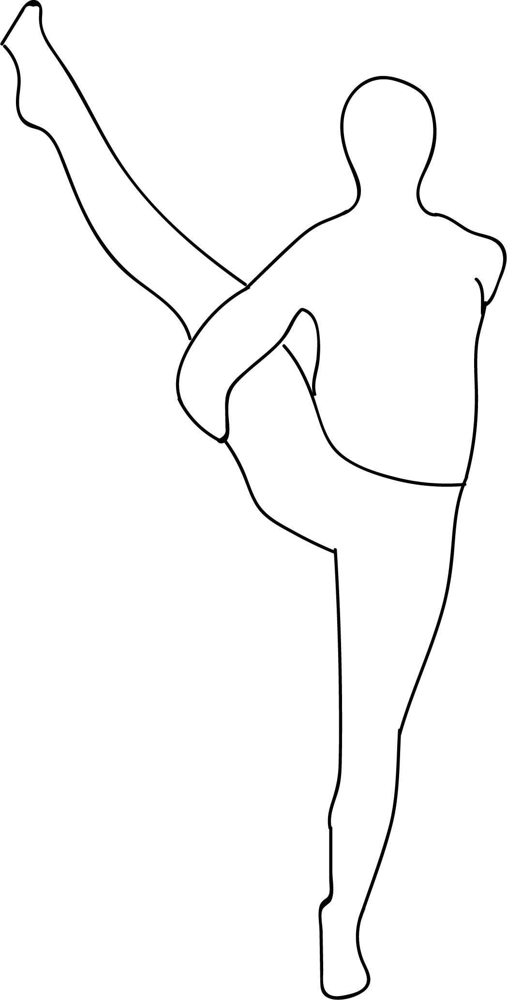

# Svarga Dvijasana

[TOC]

**Svarga Dvijasana** is an Asana. It is translated as ***Bird of Paradise Pose*** from **Sanskrit**.

## Technique
1. Begin with Utthita Parsvakonasana / Extended Side Angle Pose on your right side.
1. Move to Baddha Parsvakonasana / Bound Side Angle Pose.
1. Lift your left leg off the mat and bring it parallel to your right foot. Keep your feet at hip-width distance.
1. Shift your weight onto your left foot.
1. Inhale and lift your right leg up. Straighten your back and balance your body on your left foot.
1. Slowly straighten your right leg and gaze forward.
1. Stay in this pose for 3 to 6 long breaths.

## Technique in pictures/animation
## Effects
* This pose called bird or paradise pose.
* This pose focus on your balance, strength and flexibility.
* This pose is not very easy, but the necessity of this pose for your body is unlimited.
* This pose strengthens your knee and thigh, standing leg and ankle.
* Improve body balance and stability.
* Good for sportsman or athletes.
* It helps open groins and hips.

## Related Asanas
* [Adho Mukha Svanasana](../yoga/Adho_Mukha_Svanasana.md)

## Special requisites
It is essential to practice this pose correctly to avoid injury.

* If you are suffering from a neck injury, it might be a good idea to use a thickly folded blanket to support the head.
* You must ensure your spine is absolutely straight while practicing this asana to avoid any kind of injury.
* Pregnant women and women who are menstruating must avoid practicing this asana.
* People suffering from high blood pressure and knee injuries should also avoid this asana.

## Initial practice notes
* If you find it difficult to hold your feet, use a yoga strap by looping it around the middle arch.
* When you do this asana, you might let your tailbone arch towards the ceiling. But you have to make sure your tailbone is pressed to the floor. Only then, the hips flexibility will increase.

## References

## External Links
* [Ananda Balasana on epainassist.com](https://www.epainassist.com/yoga/ananda-balasana-or-happy-baby-pose)
* [Ananda Balasana on rishikulyogshala.org](https://www.rishikulyogshala.org/top-10-health-benefits-of-ananda-balasana-happy-baby-pose/)
* [Ananda Balasana on yogicwayoflife.com](http://www.yogicwayoflife.com/ananda-balasana-happy-baby-pose/)

## References

1. ["Methodology"](https://365dayspact.wordpress.com/2017/02/28/svarga-dvijasana-bird-of-paradise-pose-strength-and-beauty/)
2. [tips"]("Beginers)(http://www.stylecraze.com/articles/ananda-balasana-benefits/#BeginnersTips)
3. [benefits"]("Health)(http://www.yoga2all.com/yoga-pose/bird-of-paradise-pose-benefits/)
