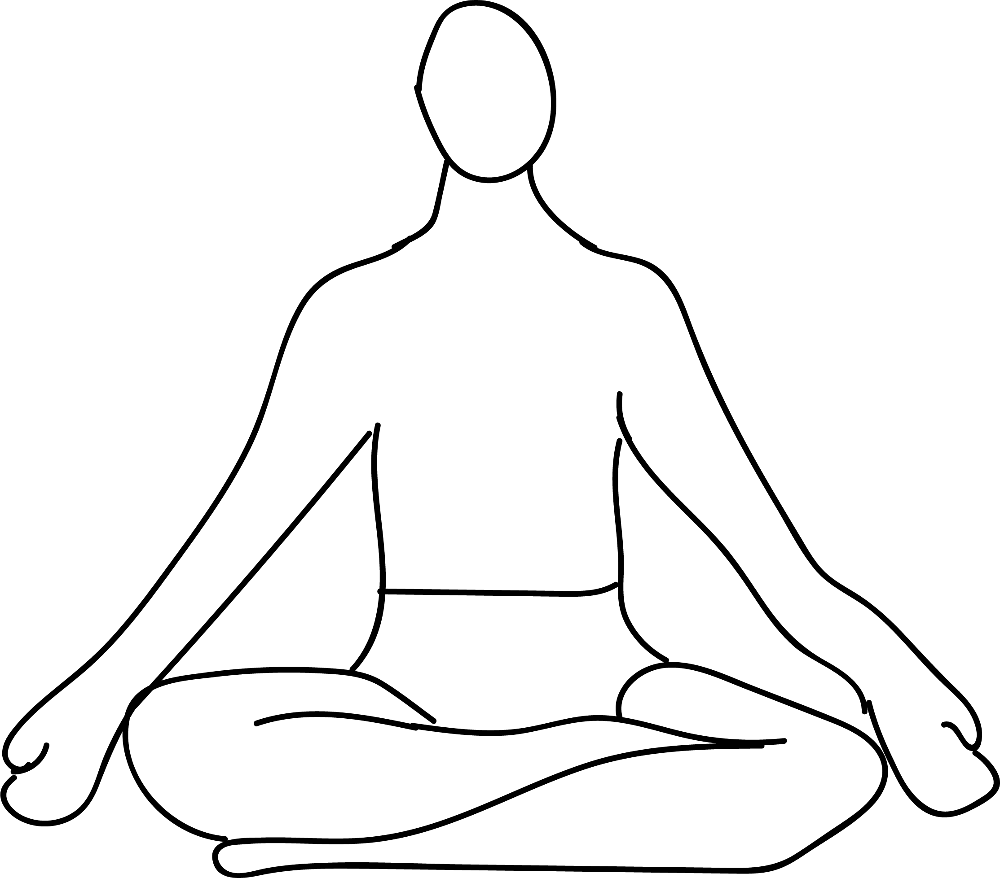

# Svastikasana

[TOC]

**Svastikasana** is an Asana. It is translated as **Cross Pose** from **Sanskrit**. The name of this pose comes from **svastika** meaning **cross**, and **asana** meaning **posture** or **seat**.

## Technique
1. First sit comfortably on the ground or floor and spread out your legs in front of you.swastikasana-steps
1. Fold your left leg; keep the sole of your left leg against the inner thigh of your right leg.
1. Now bend your right leg and keep your right foot in the space between left thigh and calf muscles.
1. Catch your left foot by the toes and try to pull it up and place it between the right calf and thigh, your knees have to firmly touch the floor.
1. Maintain the pose so that you feel relax, your body and trunk should erect.
1. Place your hands on your knees in any mudra, control on your breath. Breathing slowly and normally.
1. You may also focus on the tip of your nose or center of eye brow it’s depending on the type of meditation technique.
1. In the beginning try to sit for 10 to 15 minutes in this meditative pose, day by day increase the time of sitting.

## Technique in pictures/animation
## Effects
* It tends to tone the abdominal muscles as well as sciatic nerve. A person's concentration power tends to enhance to a great extent
* It is identified as a suitable pose in order to gain knowledge, learning as well as preparing for other form of asanas
* It tends to offer relaxation in any two sitting positions
* It tends to enhance the flow of energies in the Nadis. It is effective at cleansing the Nadis as well
* By performing this pose, a person tends to attain auspicious vibrations as well as feelings in the mind
* It is also effective at awakening the Kundalini power if performed regularly

## Related Asanas
* [Eka Bhuja Virasana](Eka_Bhuja_Virasana.md)

## Special requisites
Remember to sit erect and spine straight in order to avoid any kind of back injury. Furthermore, you must keep in mind that the soles of the feet needs to be placed between the thigh as well as calf muscles so that you can avoid any form of calf as well as hamstring damage.

## Initial practice notes
Being a beginner you must remember to keep your legs erect in knees and toes must be pointed towards the sky. You must not bend the legs in the knees. You cannot take the legs over the head in this form of pose, however you can take your legs over the head while you take or release the pose.

## References

## External Links
* [Svastikasana on fitnessvsweightloss.com](http://www.fitnessvsweightloss.com/benefits-of-the-classical-sitting-poses-in-yoga/)
* [Svastikasana on feelgoodyogavictoria.com](http://www.feelgoodyogavictoria.com/learning-centre/yoga/half-lotus-svastikasana-pose/)
* [Svastikasana on vinyasayogaacademy.com](http://vinyasayogaacademy.com/blog/benefits-of-swastikasana-auspicious-pose/)

## References

1. ["Methodology"](https://www.sarvyoga.com/swastikasana-the-auspicious-pose-steps-and-benefits/)
2. [tips"]("Beginers)(http://www.astrolika.com/yoga/svastikasana.html)
3. [benefits"]("Health)(http://www.astrolika.com/yoga/svastikasana.html)
