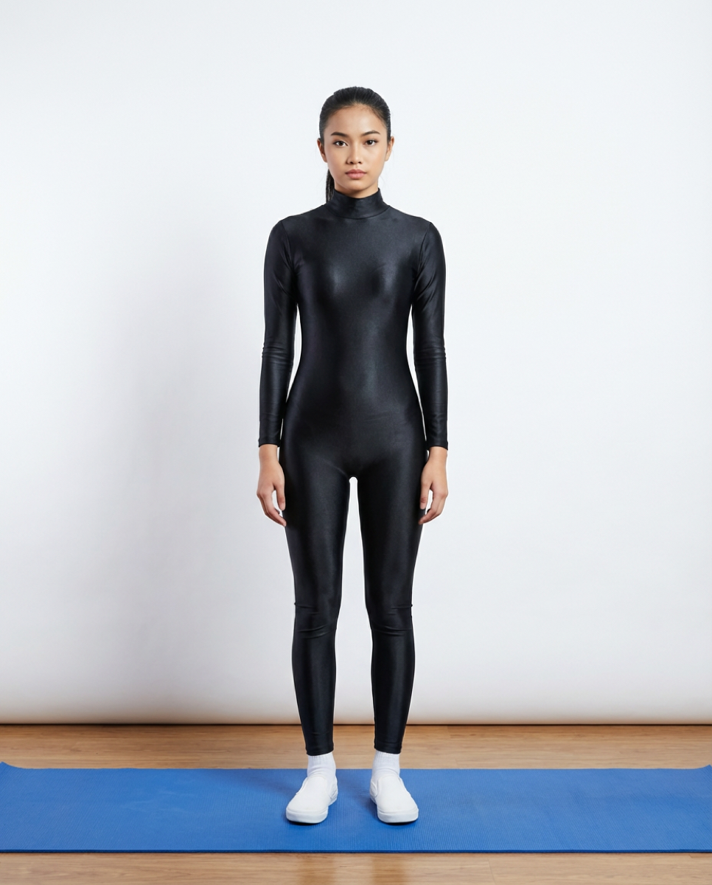

# Tadasana

[TOC]

**Tadasana** or **Mountain Pose** is an asana. Depending on the Yoga lineage practised, Samasthitiḥ and Tāḍāsana may refer to the same asana or another similar asana.

## Technique
1. Stand erect with legs slightly apart with the hands on the sides, raise the hand above the head and look straight.
1. Interlock the fingers and turn it upwards. The palms should be facing the sky, the gaze can be adjusted to look slightly above the horizontal level.
1. Take a deep breath and stretch the arms, shoulders and chest upwards.
1. Raise the heels so that the weight of the body is borne by the toes.
1. Stretch the whole body from the feet to the head.
1. Remain in this position for few seconds.
1. Bring down the heels while breathing out.
1. This is one round. One can practice up to 10 rounds.
1. During the whole practice the eyes should remain steadily fixed in front little above the head level.

## Technique in pictures/animation
## Effects
* Improves posture
* Strengthens thighs, knees, and ankles
* Increases awareness
* Steadies breathing
* Increases strength, power, and mobility in the feet, legs, and hips
* Firms abdomen and buttocks
* Relieves sciatica
* Reduces flat feet

## Related Asanas
* [Adho Mukha Svanasana](../yoga/Adho_Mukha_Svanasana.md)
* [Uttanasana](../yoga/Uttanasana.md)

## Special requisites
It is best to avoid this asana if you have the following problems:

* Headaches
* Insomnia
* Low blood pressure

## Initial practice notes
As a beginner, you might find it difficult to balance in this pose. To improve your balance, place your inner feet about three to five inches apart until you get comfortable in the pose.

## References

## External Links
* [Tadasana on eyogaguru.com](https://eyogaguru.com/tadasana-yoga-mountain-pose-benefits-steps/)
* [Tadasana on food.ndtv.com](https://food.ndtv.com/health/tadasana-the-art-of-balancing-your-body-1420167)
* [Tadasana on arogyayogaschool.com](https://arogyayogaschool.com/blog/15-health-benefits-of-mountain-pose-tadasana/)

## References

1. ["Methodology"](http://www.yogicwayoflife.com/tadasana-the-palm-tree-pose/)
2. [tips"]("Beginers)(http://www.stylecraze.com/articles/amazing-benefits-of-tadasana-yoga-for-your-body/#Beginner’sTip)
3. [benefits"]("Health)(http://www.cnyhealingarts.com/2015/04/13/the-health-benefits-of-tadasana-mountain-pose/)
