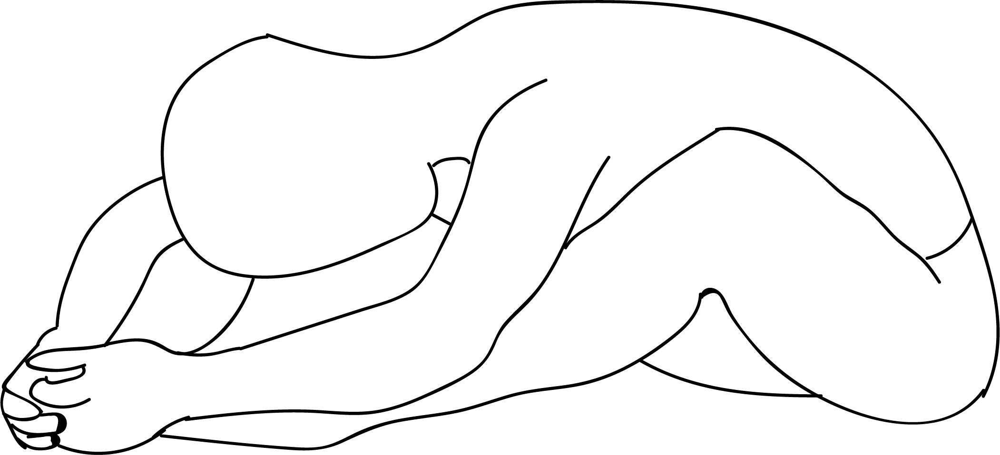

# Tarasana

[TOC]

**Tarasana** is an Asana. It is translated as ***Star Pose*** from **Sanskrit**.

The name of this pose comes from "tara" meaning "star" and "asana" meaning "posture" or "seat".

## Benefits
1. It open the inner and outer thighs and glute muscles.
1. Stretches the lower back.

## Cautions
* Be careful while doing this pose if you have ankle, knee, hip or lower back injuries.

## References

## References

1. ["wikipedia"](https://en.wikipedia.org/wiki/Tarasana)
