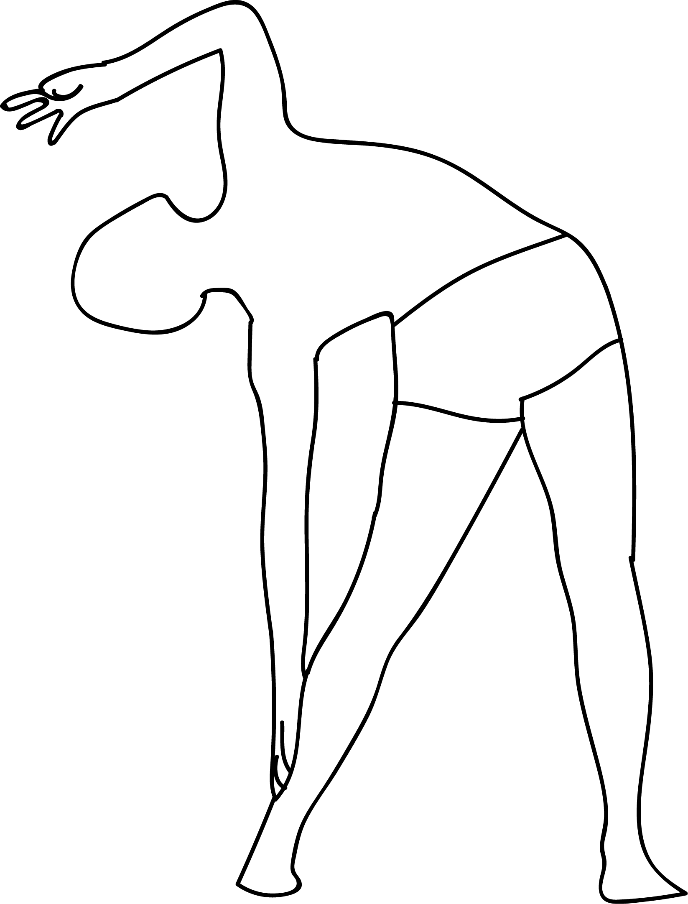

# Tiryak Tala-Vrikshasana

[TOC]

**Tiryak Tala-Vrikshasana**  is an Asana. It is translated as ***Swaying Palm Tree Pose*** from **Sanskrit**.

The name of this pose comes from "tiryak" meaning "swaying", "tala" meaning "palm", "vriksha" meaning "tree", and "asana" meaning "posture" or "seat".

## Benefits
1. It stretched the side of the body.
1. Promotes spinal flexibility and balance.

## Cautions
* Be careful while doing this pose if you have any spinal injuries.

## References

## References

1. ["wikipedia"](https://en.wikipedia.org/wiki/Tiryak_Tala-Vrikshasana)
