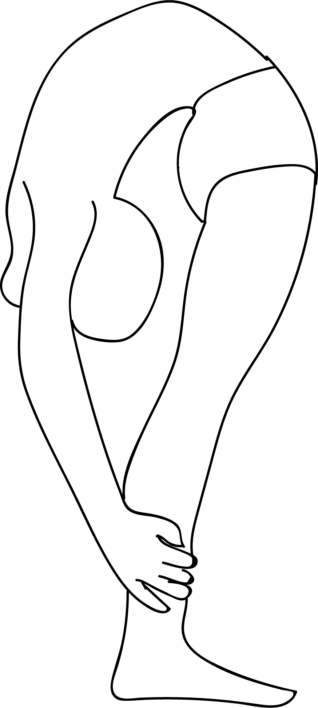

# Tiryang Mukhottanasana

[TOC]

**Tiryang Mukhottanasana**   is an Asana. It is translated as ***Reverse Facing Intense Stretch Pose*** from **Sanskrit**.

The name of this pose comes from "tiryang" meaning "reverse", "mukha" meaning "face", "uttana" meaning "intense stretch", and "asana" meaning "posture" or "seat".

## Benefits
* This pose is one of the most advanced back bends in yoga.
1. It stretches the abdominal muscles, and
1. Increases spinal flexibility.

## Cautions
* Avoid doing this pose if you have any spinal injuries.

## References

## References

1. ["wikipedia"](https://en.wikipedia.org/wiki/Tiryang_Mukhottanasana)
