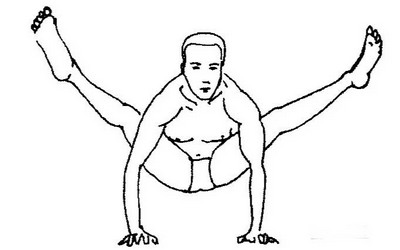

# Tittibhasana

[TOC]

**Tittibhasana** is an Asana. It is translated as **Insect Pose** or **Firefly Pose** from **Sanskrit**, the name of this pose comes from **tittibha** meaning **small insect**, and **asana** meaning **posture** or **seat**.

## Technique
1. Start the Asana with Adho Mukha Svanasana.
1. Now walk towards your hands with the end goal that your feet are before your hands. At that point, let your hands through your legs, and press them behind the calves, with the end goal that you slither further through your legs.
1. After that keep your arms and shoulders as long ways behind your thighs as you can put them. Immovably put your palms behind your feet to such an extent that your heels are held with your thumb and pointer finger (index finger).
1. Delicately twist your knees and squat as you rest the back of your legs as near your shoulders as you can.
1. Once your fingers and palms are spread, make sure you shift your body weight onto them. Lift your feet off the floor. Straighten your legs first. Then, once you stabilize, straighten your arms. Squeeze your thighs against the upper arms to gain more height. At that point spread your fingers and palms, ensure you move your body weight onto them. Raise your feet off the floor. Rectify (straighten) your legs first. After that squeeze your thighs against the upper arms to acquire stature.
1. Remain in the pose about 30 to 60 seconds. In this there is no repetition, you want to repeat this process then do it for 2 or 3 times.

## Technique in pictures/animation
## Effects
* Tightens and tones the abdominal region
* Improves digestion
* Stretches the lower back and groin
* Stretches the hamstrings
* Helps maintain equilibrium
* Helps concentration
* Good for the mind
* Strengthens arms and wrists
* Strengthens patience and perseverance
* Release tension and stress from the body

## Related Asanas
* [Garudasana](../yoga/Garudasana.md)
* [Malasana](../yoga/Malasana.md)

## Special requisites
* void this pose in case of Lower back injuries, wrist injury, and shoulder injury also.

## Initial practice notes
Like most of the arm balances, this pose is not as difficult as it looks. A good beginner’s tip for the Firefly Pose is that this pose can be approximated by sitting on the ground, spreading the legs to a 90 degree angle, raising each heel on a block and letting your palms press into the ground between your legs.

## References

## External Links
* [Tittibhasana on yogainternational.com](https://yogainternational.com/article/view/tittibhasana-firefly-pose-step-by-step)
* [Tittibhasana on yogajournal.com](https://www.yogajournal.com/practice/shine-bright)
* [Tittibhasana on getmuscularity.com](http://www.getmuscularity.com/2016/08/tittibhasana-or-firefly-pose-steps-and.html)

## References

1. ["Methodology"](https://www.sarvyoga.com/tittibhasana-firefly-pose-steps-and-benefits/)
2. [tips"]("Beginers)(http://www.yogawiz.com/yoga-poses/firefly-pose.html)
3. [benefits"]("Health)(http://vinyasayogainrishikesh.com/blog/tittibhasana-firefly-pose-steps-benefits/)
