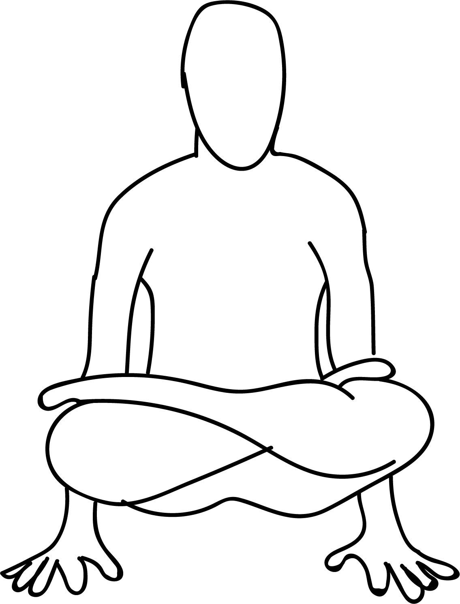

# Tolasana

[TOC]

**Tulasana** is an asana. Tola – Balance, Asana – Pose; Pronounced As – toe-lahs-anna, this asana gets its name from Tola (meaning scale) because it resembles the scale or the balance. In English, it is called the Scale Pose or the Balance Pose.

## Technique
1. Start off this asana by sitting on your mat and assuming the cross-legged posture. Make sure that your hips are higher than your knees so that you can easily slip into the Lotus Pose.
1. For this, you need to cross the foot of one leg over the thighs of the other, such that the heel of the foot is set into the crease of the hip joint. # You need to turn the sole up and lengthen the leg through the ankle. Now, bring the other foot on the other thigh, such that the heel touches the hip joint. But make sure the sole is turned upwards.
1. Flex your feet, and as you do that, make sure the ankles of both the feet are pressed down on your thighs.
1. Place your hands beside your hips, and make sure your palms are pressed firmly down. When you are ready, lift your buttocks off the ground.
1. Hold the pose for about 30-60 seconds. Then, come down, and gently release the pose. Although you don’t necessarily have to repeat the pose with the other leg up in the Lotus Pose, make sure you alternate the legs each time you practice the asana.

## Technique in pictures/animation
## Effects
* Strengthens your arms and wrists
* Tones your abdominal muscles
* Stimulates your abdominal organs
* Improves your sense of balance
* Calms your mind

## Related Asanas
* [Ardha Matsyendrasana](../yoga/Ardha_Matsyendrasana.md)
* [Baddha Konasana](Baddha_Konasana.md)
* [Garudasana](../yoga/Garudasana.md)

## Special requisites
* You must avoid this asana if you have a wrist or a shoulder injury.
* You must also avoid this asana if you have ankle or knee injuries.
* Steer clear of this asana if you have tight thighs or hips.

## Initial practice notes
As a beginner to yoga, if you find it hard to come into the full Padmasana, you can get a feel of the Tolasana with the Ardha Padmasana also.

## References

## External Links
* [Tulasana on yogajournal.com](https://www.yogajournal.com/poses/challenge-pose-scales-pose)

## References

1. ["Methodology"](https://www.stylecraze.com/articles/tolasana-scale-pose/#HowToDoTheTolasana)
2. [tips"]("Beginers)(https://www.stylecraze.com/articles/tolasana-scale-pose/#Beginner’sTips)
3. [benefits"]("Health)(http://www.cnyhealingarts.com/2011/08/15/the-health-benefits-of-the-health-benefits-of-tolasana-scale-pose/)
