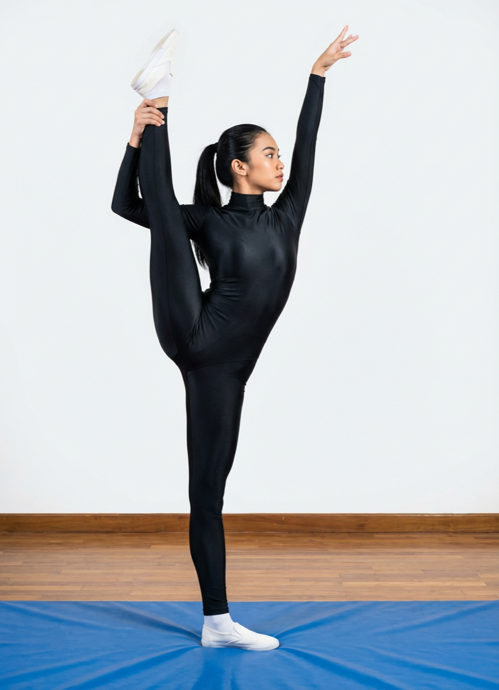

# Trivikramasana

[TOC]

**Trivikramasana** is an Asana. It is translated as **Pose Dedicated to Trivikrama** from **Sanskrit**. The name of this pose comes from **Trivikrama** in reference to a Hindu Mythology Trivikrama, and **asana** meaning **posture** or **seat**.

## Technique
1. Stand firmly.  Ensure that the entire body should be straight.
1. Slowly raise the right leg upward and then raising the right hand place them on the feet ( as shown in the Fig. 16.0).  Interlock the fingers and stretch the arms in order to ;hold the right heel  firmly.
1. Ensure that the right calf is near the right ear and then slowly widen the elbows.  while doing so ensure to maintain the body, straight and be well balanced.
1. Stay in this position for about 8 to 10 seconds with normal breathing.
1. Slowly release the right heel and the leg in order to resume the normal position.
1. Repeat the process alternatively on the other side with the same procedure.

## Technique in pictures/animation
## Effects
* This pose has the following benefits: it stretched the side of the body, the hamstrings and inner thighs, promotes spinal flexibility and balance.

## Related Asanas
* [Adho Mukha Svanasana](../yoga/Adho_Mukha_Svanasana.md)

## Special requisites
* Be careful while doing this pose if you have any balance issues, hip, ankle or shoulder injuries.

## Initial practice notes
## References

## External Links
* [Trivikramasana on yogapedia.com](https://www.yogapedia.com/definition/10355/supta-trivikramasana)
* [Trivikramasana on yogainternational.com](https://yogainternational.com/article/view/peak-pose-trivikramasana-standing-splits)
* [Trivikramasana on ihanuman.com](https://www.ihanuman.com/asana/trivikramasana)

## References

1. ["Methodology"](http://yoga.hosuronline.com/Trivikramasana.asp)
2. [benefits"]("Health)(https://ipfs.io/ipfs/QmXoypizjW3WknFiJnKLwHCnL72vedxjQkDDP1mXWo6uco/wiki/Trivikramasana.html)
