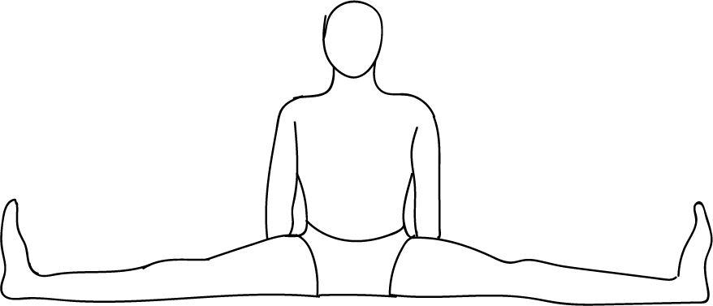

# Upavisthakonasana

[TOC]

**Upavisthakonasana**  is an Asana. It is translated as **Seated Angle Pose** from **Sanskrit**. The name of this pose comes from **upavistha** meaning **seated**, **kona** meaning **angl**, and **asana** meaning **posture** or **seat**.

## Technique
1. First, sit straight with your legs open in a way that they make 90- degree angle with your pelvis.
1. Now, keep your toes pointing up as you flex your feet and align your knees.
1. At that point, you feel curve in your lower back (for curve you may use prop; Place a firm cushion under your pelvis. The cushion gives your pelvis more stability to tilt forward).
1. Then, Keep your palms on the ground, behind your hips.
1. Take a long and deep breath in such a way that the sides of your body lift, by making a space in the spine.
1. Hang on for a few seconds if you feel a well stretch in your legs at that point.
1. Then, support your lower back and sucking your belly in, breathe out and fold.
1. Slowly place your hands in front of you. Stretch as much as you can, if you feel uneasy then stop. Breathe deep and long during holding the pose about 30 to 60 seconds.
1. Breathe out and slowly get back to your initial position.

## Technique in pictures/animation
## Effects
* It gives a good stretch to the groins and the inside muscles of the legs.
* It loosens up the lower back and hips. Those with stiff back can benefit by practicing this pose daily.
* It can give relief to sciatica.
* It strengthens the spine.
* Upavistha Konasana stretches the hamstring muscles.
* Core muscles in the lower abdomen are strengthened.
* It is a great pose to develop flexibility of the lower back, hips and abdomen.
* After a good stretch your mind also feels relaxed.
* It tones the organs in the abdomen.

## Related Asanas
* [Baddha Konasana](Baddha_Konasana.md)
* [Dandasana](../yoga/Dandasana.md)

## Special requisites
* Avoid doing this asana if you have a pull or tear in your groin or hamstring, or if you are pregnant, have an injury in the lower back, or a herniated disk.
* If you have pain in your lower back, sit on a blanket or a block while you do this asana.

## Initial practice notes
This asana is quite challenging for beginners. If you find it hard to bend forward, you could bend your knees gently. You could even use blankets to support your knees. You must move forward in the bend, and ensure your knee caps point upwards throughout the asana.

## References

## External Links
* [Upavisthakonasana on yogajournal.com](https://www.yogajournal.com/poses/wide-angle-seated-forward-bend)

* [Upavisthakonasana on dolittleyoga.com](http://www.dolittleyoga.com/pose-steps-and-benefits-of-upavistha-konasana/)

## References

1. ["Methodology"](https://www.sarvyoga.com/upavistha-konasana-wide-angle-seated-forward-bend-yoga-pose/)
2. [tips"]("Beginers)(http://www.stylecraze.com/articles/wide-angle-seated-forward-bend-pose/#Beginner’sTips)
3. [benefits"]("Health)(http://www.yogicwayoflife.com/upavistha-konasana-wide-angle-seated-forward-bend-pose/)
