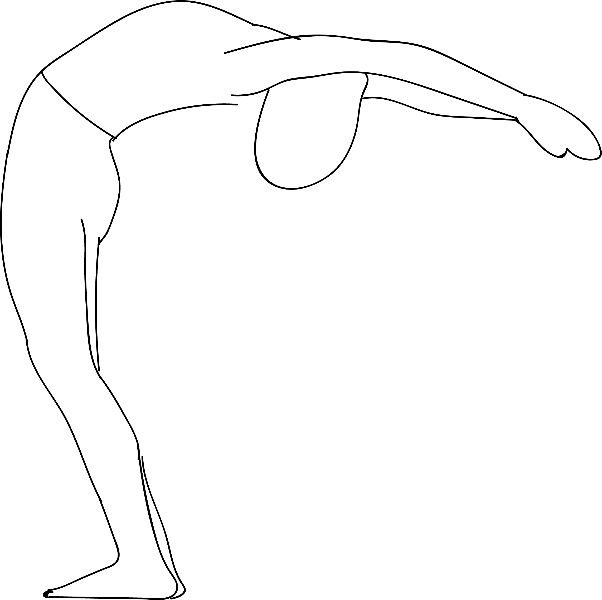

# Urdhva Hastasana

[TOC]

**Urdhva Hastasana** is a similar asana wherein the hands are not touching and the gaze is forward.It can also be performed with the thumbs interlocked.

## Technique
1. You must begin by assuming the Tadasana. Stand with your arms at your sides. Then, gently raise them to the ceiling.
1. Make sure that your arms are parallel to each other. You can also bring your palms together over your head. While you do this, make sure your shoulders are not hunched. If your palms are apart, then they must face each other. Your arms must be straight at all times such that they are activated all throughout, till your fingertips. Move your gaze upwards.
1. Your shoulders must be away from your ears, and your shoulder blades must be pressed firmly on your back.
1. Your thighs should be engaged in such a way that they pull the kneecaps up. Straighten your legs, but do not lock your knees. Always remember that a micro-bend in your knees is safer for your joints.

## Technique in pictures/animation
## Effects
* It helps to stretch the spine.
* It helps to stretch the belly.
* It helps to stretch the shoulders.
* It helps to reduce fatigue and anxiety.
* It helps in the treatment of congestion.
* It helps in the treatment of asthma.

## Related Asanas
* [Tadasana](../yoga/Tadasana.md)

## Special requisites
You must avoid practicing this asana with your arms raised if you have had an injury in your neck or shoulders.

## Initial practice notes
As a beginner, it might be hard to keep your arms straight when you raise them. You could use a shoulder-width loop to help you do this. Secure the loop around your upper arms, just above your elbows.

## References

## External Links
* [Urdhva Hastasana on yogajournal.com](https://www.yogajournal.com/poses/upward-salute)
* [Urdhva Hastasana on spotebi.com](https://www.spotebi.com/exercise-guide/urdhva-hastasana/)
* [Urdhva Hastasana on astrolika.com](http://www.astrolika.com/yoga/urdhva-hastasana.html)

## References

1. ["Methodology"](https://lifenlesson.com/upward-salute-and-its-benefits-urdhva-hastasana/)
2. [tips"]("Beginers)(http://www.stylecraze.com/articles/urdhva-hastasana-upward-salute-pose-raised-arms-stretch-pose/#Beginner’sTip)
3. [benefits"]("Health)(https://www.boldsky.com/health/wellness/2016/urdhva-hastasana-upward-salute-pose-to-relieve-stress-104192.html)
