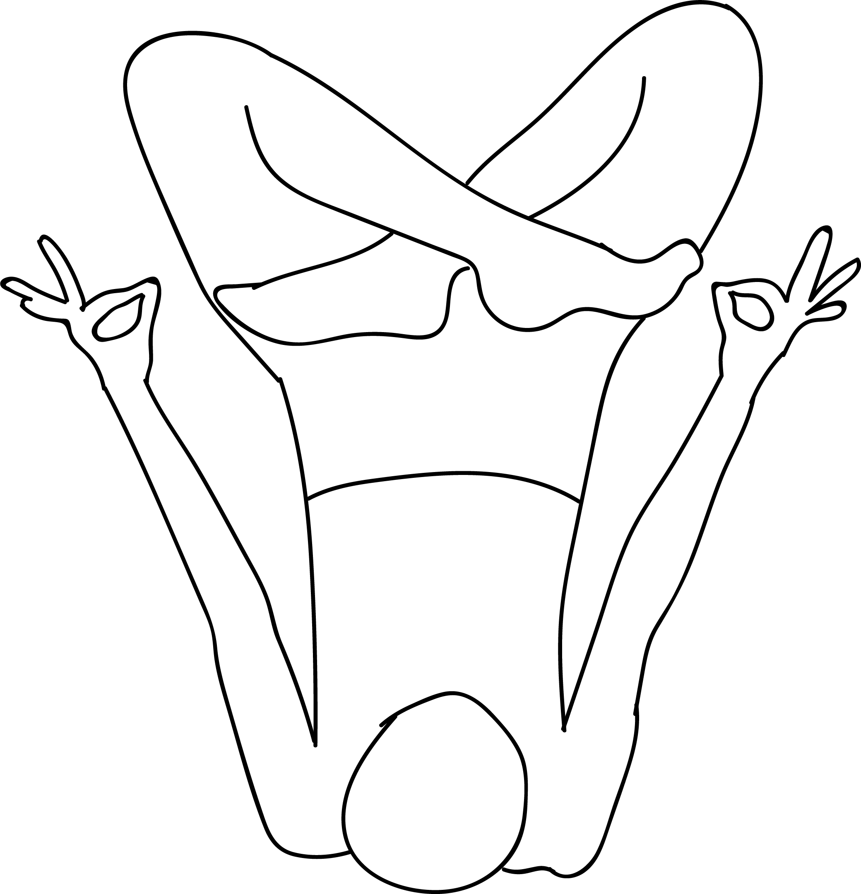

# Urdhva Padmasana in Niralamba Sarvangasana

[TOC]

**Urdhva Padmasana in Niralamba Sarvangasana** is an Asana. It is translated as **Upward Lotus Pose in Unsupported Shoulderstand Pose** from **Sanskrit**. the name of this pose comes from **urdhva** meaning **upward**, **padma** meaning **lotus**, **niralamba** meaning **unsupported**, **sarvanga** meaning **full body** and **asana** meaning **posture** or **seat**.

## Technique
1. From Salamba Sarvangasana, bend the legs at the knees and cross them. First place the right foot over the left thigh, and then the left foot over the right thigh.
1. Stretch the crossed legs vertically up, move the knees closer to each other and the legs as far back as possible from the pelvic region.
1. Stay in this pose from 20 to 30 seconds with deep and even breathing.

## Technique in pictures/animation
## Effects
This pose has many benefits: it opens up the inner hips and thighs, ankles and knees. It promotes the sense of balance.

## Related Asanas
* [Adho Mukha Svanasana](../yoga/Adho_Mukha_Svanasana.md)

## Special requisites
Be careful while doing this pose if you have any spinal, knee, ankle or hip injuries or high blood pressure

## Initial practice notes
## References

## External Links
* [Urdhva Padmasana in Niralamba Sarvangasana on tummee.com](https://www.tummee.com/yoga-poses/niralamba-sarvangasana/variations)
* [Urdhva Padmasana in Niralamba Sarvangasana on ihanuman.com](https://www.ihanuman.com/asana/urdhva-padmasana-sarvangasana)

## References

1. ["Methodology"](http://www.abhyasayoga.in/urdhva-padmasana-in-sarvangasana/)
2. [benefits"]("Health)(https://ipfs.io/ipfs/QmXoypizjW3WknFiJnKLwHCnL72vedxjQkDDP1mXWo6uco/wiki/Urdhva_Padmasana_in_Niralamba_Sarvangasana.html)
