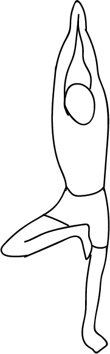

# Urdhva Vrikshasana

[TOC]

**Urdhva Vrikshasana** is an asana. An English translation for this asana is *Upward Tree Position*'. In Ashtanga Yoga it is the first asana of Surya Namaskara. In some instances this asana may also be called Tadasana, depending on the practitioner's yoga style and lineage.

## Technique
1. Stand tall and straight with arms by the side of your body.
1. Bend your right knee and place the right foot high up on your left thigh. The sole of the foot should be placed flat and firmly near the root of the thigh.
1. Make sure that your left leg is straight. Find your balance.
1. Once you are well balanced, take a deep breath in, gracefully raise your arms over your head from the side, and bring your palms together in ‘Namaste’ mudra (hands-folded position).
1. Look straight ahead in front of you, at a distant object. A steady gaze helps maintain a steady balance.
1. Ensure that your spine is straight. Your entire body should be taut, like a stretched elastic band. Keep taking in long deep breaths. With each exhalation, relax the body more and more. Just be with the body and the breath with a gentle smile on your face.
1. With slow exhalation, gently bring down your hands from the sides. You may gently release the right leg.
1. Stand tall and straight as you did at the beginning of the posture. Repeat this pose with the left leg off the ground on the right thigh.

## Technique in pictures/animation
## Effects
* Strengthens the spine.
* It strengthens the tendons and ligaments of the feet.
* It tones up the leg muscles.
* Strengthens the knee.
* Flexibles the hip joints.
* Strengthens the inner ears, eyes and shoulders.
* Beneficial in sciatica and useful in flat feet problem.
* Gives calmness to mind and makes you body sturdy as well as flexible.
* Boost the concentration and mental faculties.
* Best for problems related to postural problems.

## Related Asanas
* [Utkatasana](../yoga/Utkatasana.md)

## Special requisites
* Avoid doing this posture if you are suffering from migraine, insomnia, low or high blood pressure.

## Initial practice notes
## References

## External Links
* [Urdhva Vrikshasana on en.wikipedia.org](https://en.wikipedia.org/wiki/Urdhva_Vrikshasana)
* [Urdhva Vrikshasana on arogyayogaschool.com](https://arogyayogaschool.com/blog/health-benefits-vrikshasana-tree-pose/)

## References

1. ["Methodology"](https://www.artofliving.org/in-en/yoga/yoga-poses/tree-pose-vrikshasana)
2. [benefits"]("Health)(https://www.sarvyoga.com/vrikshasana-tree-pose-steps-benefits/)
