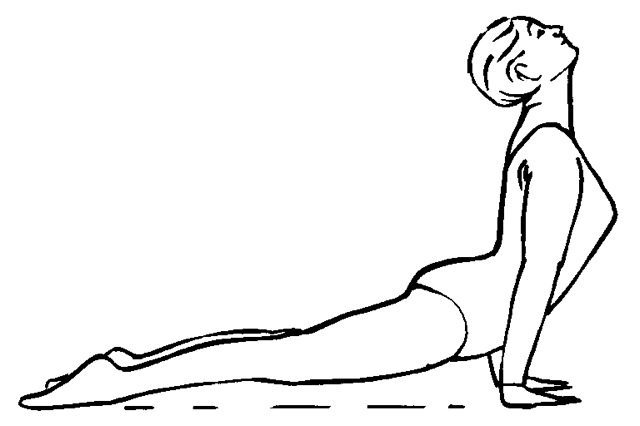

# Urdhvamukha shvanasana

[TOC]

**Urdhvamukha shvanasana** (Sanskrit: ऊर्ध्वमुखश्वानासन; Sanskrit pronunciation: [urd̪ʱhvə mukʰə ɕʋɑːn̪ɑːs̪ən̪ə] IAST: Urdhva mukha śvānāsana) or Upward Facing Dog Pose is an asana.

## Technique
1. Lie on your stomach.
1. Place hands next to your shoulders.
1. On an inhalation, roll the shoulders back and down and straighten your arms as much as you can without straining your lower back.
1. Lift your thighs off of the ground by pushing your pelvis forward
1. Hold the pose for 15 to 30 seconds before releasing back to the floor.

## Technique in pictures/animation
## Effects
1. Best exercise for your wrists.
1. Beneficial for lower back coz this pose stretches the lower back muscles.
1. Stretches the muscles of the shoulders and chest also.
1. It tones and stimulates the abdominal muscles and organs
1. It improves the posture of the body.
1. Beneficial for chest, heart and lungs.
1. It stretches the upper back and front of your body
1. Gives strength to your shoulders, wrists, arms and back bone.

## Related Asanas
* [Phalakasana](Phalakasana.md)
* [Uttanasana](../yoga/Uttanasana.md)

## Special requisites
Avoid practicing this asana if you suffer from:

Carpal tunnel syndrome
High blood pressure
A detached retina
A dislocated shoulder
Weak eye capillaries
Diarrhea.

## Initial practice notes
There's a tendency in this pose to "hang" on the shoulders, which lifts them up toward the ears and "turtles" the neck. Actively draw the shoulders away from the ears by lengthening down along the back armpits, pulling the shoulder blades toward the tailbone, and puffing the side ribs forward.

## References

## External Links
* [Urdhvamukha shvanasana on yogainternational.com](https://yogainternational.com/article/view/urdhva-mukha-shvanasana-upward-facing-dog)
* [Urdhvamukha shvanasana on en.wikipedia.org](https://en.wikipedia.org/wiki/Urdhvamukha_shvanasana)
* [Urdhvamukha shvanasana on easyayurveda.com](https://easyayurveda.com/2018/04/16/urdhva-mukha-svanasana/)

## References

1. ["Methodology"](https://www.yogapaws.com/products/urdhva-mukha-shvanasana-upward-facing-dog-pose)
2. [tips"]("Beginers)(https://www.yogajournal.com/poses/upward-facing-dog)
3. [benefits"]("Health)(http://www.omyogaacademy.com/blog/yoga-teacher-training/urdhva-mukha-svanasanaupward-facing-dog-pose/)
