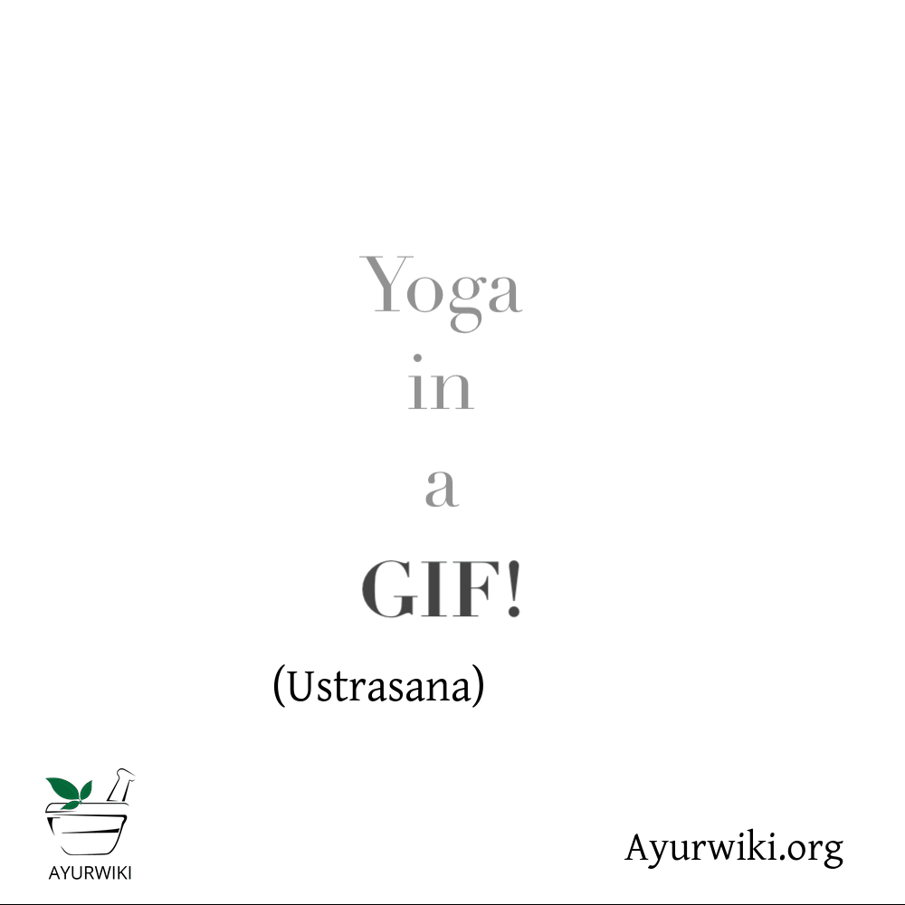
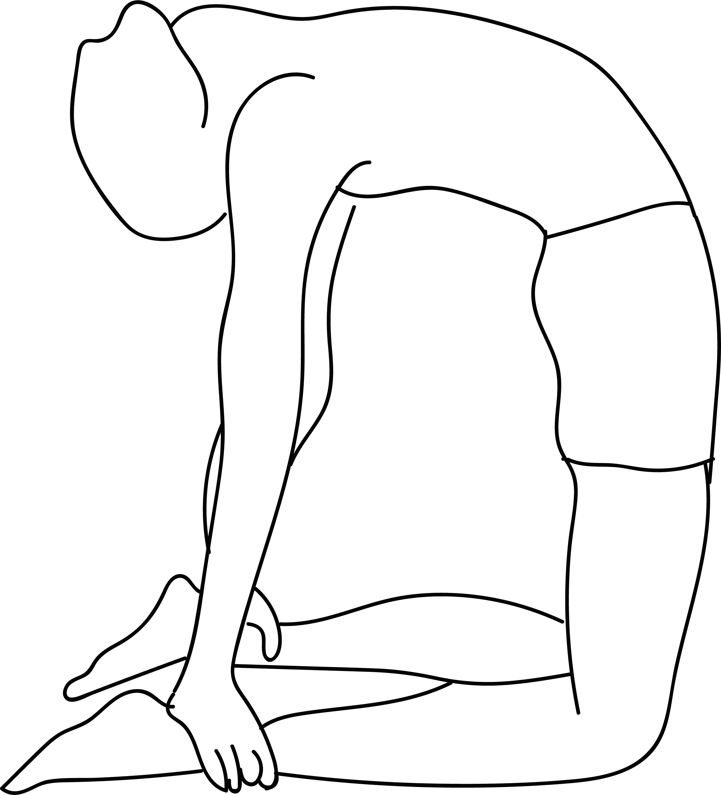

# Ustrasana

[TOC]

**Ustrasana** is an intermediate level back-bending yoga posture known to open Anahata (Heart chakra). This yoga posture adds flexibility and strength to the body and also helps in improving digestion.

## Technique
1. Kneel on the yoga mat and place your hands on the hips.
1. Your knees should be in line with the shoulders and the sole of your feet should be facing the ceiling.
1. As you inhale, draw in your tail-bone towards the pubis as if being pulled from the navel.
1. Simultaneously, arch your back and slide your palms over your feet till the arms are straight.
1. Do not strain or flex your neck but keep it in a neutral position.
1. Stay in this posture for a couple of breaths.
1. Breathe out and slowly come back to the initial pose. Withdraw your hands and bring them back to your hips as you straighten up.

## Effects
* Reduces fat on thighs
* Opens up the hips, stretching deep hip flexors
* Stretches and strengthens the shoulders and back
* Expands the abdominal region, improving digestion and elimination
* Improves posture
* Opens the chest, improving respiration
* Loosens up the vertebrae
* Relieves lower back pain
* Helps to heal and balance the chakras
* Strengthens thighs and arms

## Related Asanas
* [Bhujangasana]]
* [Salabhasana](../yoga/Salabhasana.md)
* [Supta Virasana](../yoga/Supta_Virasana.md)

## Special requisites
* This asana should not be practiced if you suffer from a hernia, high or low blood pressure, pain in the lower back, migraines, headaches, neck injuries, or if you have had an abdominal surgery recently.
* Women should avoid this asana during pregnancy.

## Initial practice notes
When you are starting off, it can be difficult to reach for your feet with your hands, without causing a strain in your back or neck. You can turn your toes, and elevate your heels. If you still can’t reach for your legs, use a wooden block and place both your hands on them.

## References

## External Links
* [Ustrasana on doyouyoga.com](https://www.doyouyoga.com/the-holistic-benefits-of-camel-pose/)
* [Ustrasana on rishikulyogshala.org](https://www.rishikulyogshala.org/top-7-health-benefits-of-ustrasana-camel-pose/)
* [Ustrasana on finessyoga.com](http://www.finessyoga.com/yoga-asanas/ustrasana-camel-pose-steps-precautions-benefits)

## References

1. ["Methodology"](http://www.stylecraze.com/articles/ananda-balasana-benefits/#HowToDoThisAsana)
2. [tips"]("Beginers)(http://www.stylecraze.com/articles/ananda-balasana-benefits/#BeginnersTips)
3. [benefits"]("Health)(http://www.cnyhealingarts.com/2011/01/11/the-health-benefits-of-ustrasana-camel-pose/)
