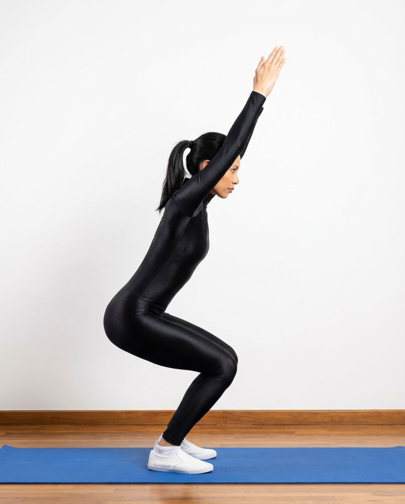

# Utkatasana

[TOC]

**Utkata** is a Sanskrit word, which means frightening, intense, furious, wild or heavy and the meaning of asana is to seat, pose or posture. Utkatasana (Chair Yoga Pose) is a simple pose, in this, you have to imagine that you are sitting in the chair and your body posture look like as you are sitting in the chair.

## Technique
* Stand erect with your feet slightly apart.
* Inhale and raise your arms perpendicular to the floor. Either keep the arms parallel, palms facing inward, or join your palms.
* Exhale and bend your knees, trying to keep your thighs as parallel to the floor as possible.
* Your knees will project out over your feet, and your torso will lean forward slightly over your thighs until your torso forms an approximate right angle with the tops of your thighs.
* Keep your thighs parallel to each other and push down on your pelvis towards your heels.
* Firm your shoulder blades against your back and keep your spine lengthened.
* Stay in this position for 30 seconds to a minute, while breathing evenly.

## Effects
* Tones the leg muscles excellently
* Strengthens hip flexors, ankles, calves, and back
* Stretches chest and shoulders
* Reduces symptoms of flat feet
* Stimulates the heart, diaphragm, and abdominal organs

## Related Asanas
* [Virasana](../yoga/Virasana.md)
* [Bhujangasana](../yoga/Bhujangasana.md)
* [Adho Mukha Svanasana](../yoga/Adho_Mukha_Svanasana.md)

## Special requisites
This asana must be avoided if you are suffering from the following problems:
* Insomnia
* Low blood pressure
* Headaches
* Arthritis
* A sprained ankle
* Chronic knee pain
* Damaged ligaments

## Initial practice notes
As a beginner, it can be quite challenging to hold the pose for a long time. You can use the support of a wall as you start off.

## References

## External Links
* [Utkatasana on artofliving.org](https://www.artofliving.org/yoga/yoga-poses/chair-pose-utkatasana)
* [Utkatasana on yogajournal.com](https://www.yogajournal.com/poses/chair-pose)
* [Utkatasana on eyogaguru.com](https://eyogaguru.com/chair-pose-utkatasana-steps-benefits-precautions-eyogaguru/)

## References

1. ["Methodology"](https://thehealthorange.com/stay-fit/yoga/how-to-do-utkatasana-chair-pose-in-7-steps-its-benefits/)
2. [tips"]("Beginers)(http://www.stylecraze.com/articles/utkatasana-chair-pose/#Beginner’sTip)
3. [benefits"]("Health)(http://www.cnyhealingarts.com/2011/03/01/the-health-benefits-of-utkatasana-chair-pose/)
